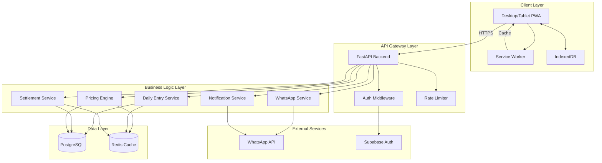
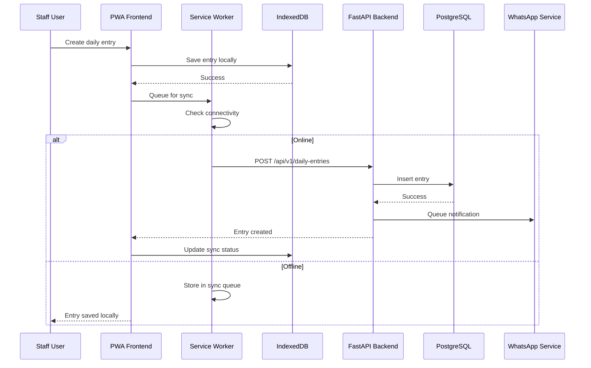
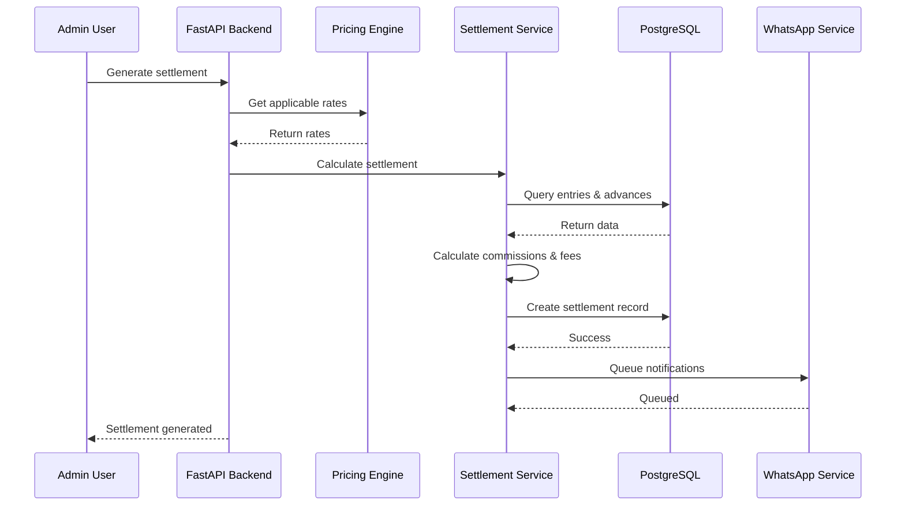
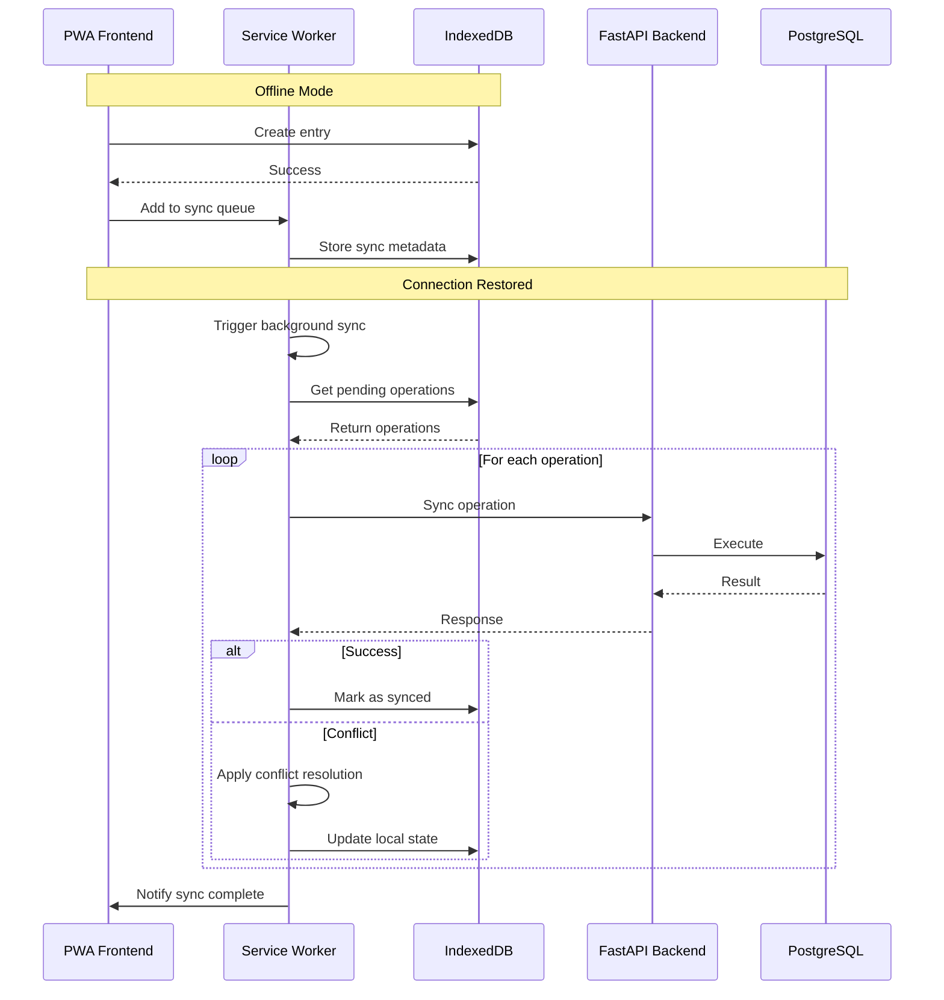

# Malar Market Digital Ledger - System Architecture

## Table of Contents

1. [Overview](#overview)
2. [System Architecture](#system-architecture)
3. [Data Flow](#data-flow)
4. [Offline-First Strategy](#offline-first-strategy)
5. [Security Considerations](#security-considerations)
6. [Scalability Approach](#scalability-approach)
7. [Technology Rationale](#technology-rationale)

---

## Overview

The Malar Market Digital Ledger is a hybrid Desktop/Tablet Progressive Web Application (PWA) designed for managing flower commission business operations. The system is architected to handle critical morning rush hours (4-9 AM) with offline-first capabilities while maintaining data consistency and real-time synchronization when connectivity is available.

### Key Architectural Principles

1. **Offline-First**: The application functions fully without internet connectivity during peak hours
2. **Event-Driven**: Asynchronous processing for WhatsApp notifications and settlements
3. **Microservices-Ready**: Modular design allowing future service separation
4. **Data Consistency**: Strong consistency guarantees with conflict resolution strategies
5. **Bilingual Native**: Language support integrated at the core, not as an afterthought

---

## System Architecture

### High-Level Architecture Diagram



### Component Breakdown

#### Client Layer

**Progressive Web Application (PWA)**
- Built with React.js and Vite for optimal performance
- Service Worker for offline caching and background sync
- IndexedDB for local data persistence
- Responsive design for desktop and tablet devices

**Service Worker**
- Caches critical assets (HTML, CSS, JS, images)
- Implements stale-while-revalidate strategy for API responses
- Manages background sync queue
- Handles offline-to-online transition

**IndexedDB**
- Stores daily entries locally
- Caches market rates and farmer data
- Maintains sync queue for offline operations
- Implements conflict resolution metadata

#### API Gateway Layer

**FastAPI Backend**
- High-performance async Python framework
- Automatic OpenAPI documentation
- Request validation with Pydantic
- Dependency injection for clean architecture

**Auth Middleware**
- JWT token validation
- Role-based access control (RBAC)
- Session management
- Refresh token rotation

**Rate Limiter**
- Prevents API abuse
- Per-user rate limiting
- IP-based throttling
- Redis-backed for distributed systems

#### Business Logic Layer

**Daily Entry Service**
- CRUD operations for daily flower entries
- Validation of entry data
- Time-based pricing application
- Auto-calculation of totals

**Settlement Service**
- Commission calculation
- Fee deduction logic
- Advance balance tracking
- Settlement generation and approval

**Pricing Engine**
- Time-based pricing rules
- Market rate management
- Dynamic pricing adjustments
- Historical rate tracking

**WhatsApp Service**
- Message template management
- Queue-based message sending
- Delivery tracking
- Error handling and retries

**Notification Service**
- Event-driven notifications
- Multi-channel support (WhatsApp, in-app)
- Notification preferences
- Delivery status tracking

#### Data Layer

**PostgreSQL (via Supabase)**
- Primary relational database
- ACID compliance for transactional integrity
- Full-text search capabilities
- JSONB for flexible schema evolution

**Redis Cache**
- Session storage
- Rate limiting counters
- Market rate caching
- Real-time data synchronization

#### External Services

**WhatsApp API (Twilio/Interakt)**
- Message delivery
- Template approval workflow
- Webhook handling
- Rate limit management

**Supabase Auth**
- User authentication
- Social login support
- Email verification
- Password reset

---

## Data Flow

### Daily Entry Creation Flow



### Settlement Processing Flow



### Offline Sync Flow



---

## Offline-First Strategy

### Design Philosophy

The application is designed to operate seamlessly during morning rush hours (4-9 AM) when internet connectivity may be unreliable. The offline-first strategy ensures business continuity without data loss.

### Core Components

#### 1. Service Worker Caching Strategy

**Cache-First for Static Assets**
- HTML, CSS, JS files
- Images and icons
- Fonts
- Cached on first load, updated in background

**Network-First for API Calls**
- Real-time data synchronization
- Fallback to cached data if network fails
- Automatic retry with exponential backoff

**Stale-While-Revalidate for Reference Data**
- Market rates
- Farmer information
- Configuration data
- Serve cached immediately, update in background

#### 2. IndexedDB Data Structure

```javascript
// Object Stores
- daily_entries: {
    id, farmer_id, date, flower_type, quantity, 
    rate, total, synced, sync_timestamp
}
- sync_queue: {
    id, operation, payload, status, retry_count, 
    last_attempt
}
- market_rates: {
    id, flower_type, time_slot, rate, effective_date
}
- farmers: {
    id, name, phone, whatsapp_number, balance, 
    last_updated
}
```

#### 3. Sync Queue Management

**Operation Types**
- CREATE: New daily entry
- UPDATE: Modified entry
- DELETE: Removed entry
- SETTLEMENT: Settlement generation

**Queue Processing**
- Prioritize by operation type (CREATE > UPDATE > DELETE)
- Exponential backoff for retries (1s, 2s, 4s, 8s, 16s)
- Max retry limit: 5 attempts
- Conflict resolution on concurrent edits

#### 4. Conflict Resolution Strategy

**Last-Write-Wins with Timestamp**
- Each record includes `updated_at` timestamp
- Server timestamp takes precedence
- Local changes preserved if no server conflict

**Merge Strategy for Specific Fields**
- Quantity: Sum if same entry modified
- Rate: Server rate takes precedence
- Status: Server status takes precedence

**User Notification**
- Conflicts displayed in sync status panel
- Manual resolution option for critical data
- Audit log of all conflict resolutions

### Offline Capabilities

**Full Offline Features**
- Create daily entries
- View cached market rates
- Access farmer information
- Generate local reports
- View sync status

**Limited Offline Features**
- Settlement generation (requires rate validation)
- WhatsApp notifications (queued for later)
- Real-time updates (cached data only)

**No Offline Features**
- User authentication (requires online)
- Market rate updates
- Settlement approvals by farmers

---

## Security Considerations

### Authentication & Authorization

#### JWT-Based Authentication

**Token Structure**
```json
{
  "sub": "user_id",
  "role": "admin|staff|farmer",
  "iat": 1234567890,
  "exp": 1234567890,
  "jti": "unique_token_id"
}
```

**Token Lifecycle**
- Access Token: 15 minutes validity
- Refresh Token: 7 days validity
- Refresh Rotation: New refresh token on each refresh
- Token Revocation: Blacklist in Redis

#### Role-Based Access Control (RBAC)

**Role Permissions Matrix**

| Operation | Admin | Staff | Farmer |
|-----------|-------|-------|--------|
| Create daily entry | ✓ | ✓ | ✗ |
| Edit own entry | ✓ | ✓ | ✗ |
| Edit any entry | ✓ | ✗ | ✗ |
| Generate settlement | ✓ | ✗ | ✗ |
| Approve settlement | ✓ | ✓ | ✓ |
| View reports | ✓ | ✓ | Limited |
| Manage users | ✓ | ✗ | ✗ |
| Configure rates | ✓ | ✗ | ✗ |

### Data Security

#### Encryption
- TLS 1.3 for all HTTP communications
- AES-256 for sensitive data at rest (optional)
- Hashed passwords using bcrypt

#### Input Validation
- Pydantic schemas for request validation
- SQL injection prevention via ORM
- XSS prevention via React's built-in escaping
- CSRF protection via same-site cookies

#### Audit Logging
- All CRUD operations logged
- Include user, timestamp, operation, and data
- Security events (login failures, permission denials)
- Log retention: 90 days

### API Security

#### Rate Limiting
- Global: 1000 requests/minute
- Per user: 100 requests/minute
- Per endpoint: Custom limits
- Redis-backed for distributed systems

#### CORS Configuration
- Strict origin whitelist
- Allow only necessary methods
- Credentials included for authenticated requests

#### API Key Management
- WhatsApp API keys stored in environment variables
- Key rotation policy: 90 days
- Separate keys for development and production

### PWA Security

#### Service Worker Security
- HTTPS required for service worker registration
- Cache validation on each update
- No sensitive data in cache

#### IndexedDB Security
- No passwords or tokens stored
- Encrypted sensitive fields (optional)
- Clear data on logout

---

## Scalability Approach

### Horizontal Scaling

#### Backend Scaling
- Stateless FastAPI application
- Session storage in Redis
- Load balancer with round-robin
- Auto-scaling based on CPU/memory

#### Database Scaling
- Read replicas for reporting queries
- Connection pooling (PgBouncer)
- Database sharding (future consideration)
- Archive old data to cold storage

#### Frontend Scaling
- CDN for static assets (Vercel Edge Network)
- Service worker caching reduces server load
- Optimistic UI updates reduce perceived latency

### Performance Optimization

#### Database Optimization
- Indexed columns: farmer_id, date, flower_type
- Query optimization with EXPLAIN ANALYZE
- Materialized views for complex reports
- Partitioning by date for daily_entries table

#### Caching Strategy
- Redis for frequently accessed data
- Cache invalidation on data changes
- Cache TTL: 5 minutes for market rates
- Cache TTL: 1 hour for farmer data

#### API Optimization
- Pagination for list endpoints
- Field selection (GraphQL-like filtering)
- Batch operations for bulk inserts
- Compression for large payloads

### Monitoring & Observability

#### Metrics Collection
- Response times (p50, p95, p99)
- Error rates by endpoint
- Database query performance
- Cache hit/miss ratios

#### Logging
- Structured JSON logging
- Log levels: DEBUG, INFO, WARNING, ERROR
- Centralized log aggregation (future)
- Alerting on critical errors

#### Tracing
- Distributed tracing with OpenTelemetry
- Request correlation IDs
- Performance bottleneck identification

### Disaster Recovery

#### Backup Strategy
- Daily automated database backups
- Point-in-time recovery (7 days)
- Backup storage: Multiple regions
- Backup restoration testing: Monthly

#### High Availability
- Multi-region deployment (future)
- Database failover: Automatic
- Load balancer health checks
- Graceful degradation on failures

---

## Technology Rationale

### Frontend Stack

**React.js + Vite**
- React: Component-based architecture, large ecosystem
- Vite: Fast development server, optimized production builds
- PWA Support: Service worker, offline capabilities
- TypeScript: Type safety, better developer experience

**Rationale**: React's component model fits well with the complex UI requirements of daily entry management and settlement processing. Vite provides fast development iteration times, crucial for rapid prototyping and testing.

### Backend Stack

**FastAPI**
- Async/await for high concurrency
- Automatic OpenAPI documentation
- Pydantic for validation
- Type hints for better code quality

**Rationale**: FastAPI's async nature is ideal for handling multiple concurrent requests during morning rush hours. The automatic documentation reduces maintenance overhead.

**SQLAlchemy ORM**
- Database abstraction
- Migration support via Alembic
- Query optimization
- Relationship management

**Rationale**: SQLAlchemy provides a robust ORM with excellent PostgreSQL support, crucial for complex financial calculations and reporting.

### Database Choice

**PostgreSQL via Supabase**
- ACID compliance for transactional integrity
- JSONB for flexible schema evolution
- Full-text search capabilities
- Built-in authentication (optional)

**Rationale**: PostgreSQL's reliability and feature set make it ideal for financial applications. Supabase provides managed PostgreSQL with additional features like real-time subscriptions.

### Caching Layer

**Redis**
- In-memory performance
- Data structures for complex operations
- Persistence options
- Pub/sub for real-time updates

**Rationale**: Redis provides fast caching for frequently accessed data like market rates and session storage, reducing database load.

### WhatsApp Integration

**Twilio/Interakt**
- Reliable message delivery
- Template management
- Webhook support
- Multi-region support

**Rationale**: Both providers offer robust WhatsApp Business API integration with good documentation and support for the Indian market.

### Deployment Infrastructure

**Vercel (Frontend)**
- Automatic HTTPS
- Edge network for global performance
- Preview deployments
- Easy configuration

**Render/DigitalOcean (Backend)**
- Docker support
- Auto-scaling
- Managed databases
- Competitive pricing

**Rationale**: Vercel provides excellent frontend hosting with automatic HTTPS and CDN. Render/DigitalOcean offer cost-effective backend hosting with good developer experience.

---

## Future Considerations

### Phase 2 Enhancements
- Real-time collaboration for multiple staff members
- Mobile app (React Native) for field operations
- Advanced analytics and forecasting
- Integration with accounting software
- SMS fallback for WhatsApp failures

### Phase 3 Enhancements
- Machine learning for demand prediction
- Blockchain for immutable audit trail
- Multi-market support
- Farmer mobile app for self-service
- Voice-to-text entry for faster data input

---

**Document Version**: 1.0
**Last Updated**: 2026-02-14
**Author**: Architecture Team
