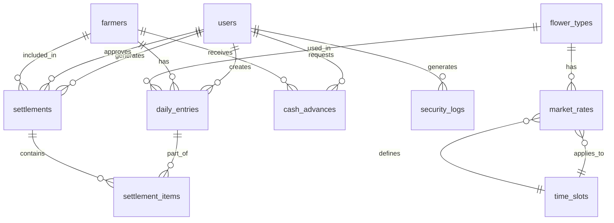

# Malar Market Digital Ledger - Database Schema

## Table of Contents

1. [Overview](#overview)
2. [Entity Relationship Diagram](#entity-relationship-diagram)
3. [Table Definitions](#table-definitions)
4. [Relationships](#relationships)
5. [Indexes](#indexes)
6. [Constraints](#constraints)
7. [Sample Data](#sample-data)

---

## Overview

The database schema for Malar Market Digital Ledger is designed to support:
- Daily flower entry tracking
- Time-based pricing with multiple time slots
- Complex financial settlements with commissions and fees
- Cash advance management
- Comprehensive audit logging
- Role-based access control

### Design Principles

1. **Normalization**: Third normal form (3NF) to minimize redundancy
2. **Auditability**: All critical tables include created_at and updated_at timestamps
3. **Soft Deletes**: Deleted records are marked with deleted_at instead of hard deletion
4. **Referential Integrity**: Foreign key constraints ensure data consistency
5. **Performance**: Strategic indexing on frequently queried columns

---

## Entity Relationship Diagram



---

## Table Definitions

### 1. users

Stores application users with role-based access control.

| Column | Type | Constraints | Description |
|--------|------|-------------|-------------|
| id | UUID | PRIMARY KEY | Unique user identifier |
| email | VARCHAR(255) | UNIQUE, NOT NULL | User email address |
| password_hash | VARCHAR(255) | NOT NULL | Bcrypt hashed password |
| full_name | VARCHAR(255) | NOT NULL | User's full name |
| phone | VARCHAR(20) | UNIQUE | Contact phone number |
| role | ENUM | NOT NULL | Role: admin, staff, farmer |
| is_active | BOOLEAN | NOT NULL, DEFAULT TRUE | Account status |
| email_verified | BOOLEAN | NOT NULL, DEFAULT FALSE | Email verification status |
| language_preference | VARCHAR(5) | NOT NULL, DEFAULT 'en' | Preferred language: en, ta |
| created_at | TIMESTAMP | NOT NULL, DEFAULT NOW() | Account creation timestamp |
| updated_at | TIMESTAMP | NOT NULL, DEFAULT NOW() | Last update timestamp |
| deleted_at | TIMESTAMP | NULLABLE | Soft delete timestamp |

**Indexes:**
- `idx_users_email` on (email)
- `idx_users_role` on (role)
- `idx_users_is_active` on (is_active)

### 2. farmers

Stores farmer information linked to user accounts.

| Column | Type | Constraints | Description |
|--------|------|-------------|-------------|
| id | UUID | PRIMARY KEY | Unique farmer identifier |
| user_id | UUID | UNIQUE, REFERENCES users(id) | Linked user account |
| farmer_code | VARCHAR(20) | UNIQUE, NOT NULL | Unique farmer code |
| name | VARCHAR(255) | NOT NULL | Farmer name |
| village | VARCHAR(255) | Village location |
| phone | VARCHAR(20) | NOT NULL | Contact phone number |
| whatsapp_number | VARCHAR(20) | WhatsApp number |
| address | TEXT | Full address |
| current_balance | DECIMAL(10,2) | NOT NULL, DEFAULT 0.00 | Current account balance |
| total_advances | DECIMAL(10,2) | NOT NULL, DEFAULT 0.00 | Total advances taken |
| total_settlements | DECIMAL(10,2) | NOT NULL, DEFAULT 0.00 | Total settlements received |
| is_active | BOOLEAN | NOT NULL, DEFAULT TRUE | Farmer status |
| created_at | TIMESTAMP | NOT NULL, DEFAULT NOW() | Record creation timestamp |
| updated_at | TIMESTAMP | NOT NULL, DEFAULT NOW() | Last update timestamp |
| deleted_at | TIMESTAMP | NULLABLE | Soft delete timestamp |

**Indexes:**
- `idx_farmers_user_id` on (user_id)
- `idx_farmers_farmer_code` on (farmer_code)
- `idx_farmers_phone` on (phone)
- `idx_farmers_is_active` on (is_active)

### 3. flower_types

Master table for flower varieties.

| Column | Type | Constraints | Description |
|--------|------|-------------|-------------|
| id | UUID | PRIMARY KEY | Unique flower type identifier |
| name | VARCHAR(255) | UNIQUE, NOT NULL | Flower name (English) |
| name_ta | VARCHAR(255) | Flower name (Tamil) |
| code | VARCHAR(20) | UNIQUE, NOT NULL | Flower code |
| description | TEXT | Flower description |
| unit | VARCHAR(20) | NOT NULL | Unit of measurement: kg, bunch, piece |
| is_active | BOOLEAN | NOT NULL, DEFAULT TRUE | Flower type status |
| created_at | TIMESTAMP | NOT NULL, DEFAULT NOW() | Record creation timestamp |
| updated_at | TIMESTAMP | NOT NULL, DEFAULT NOW() | Last update timestamp |

**Indexes:**
- `idx_flower_types_code` on (code)
- `idx_flower_types_is_active` on (is_active)

### 4. time_slots

Defines time-based pricing slots.

| Column | Type | Constraints | Description |
|--------|------|-------------|-------------|
| id | UUID | PRIMARY KEY | Unique time slot identifier |
| name | VARCHAR(100) | NOT NULL | Time slot name |
| name_ta | VARCHAR(100) | Time slot name (Tamil) |
| start_time | TIME | NOT NULL | Slot start time |
| end_time | TIME | NOT NULL | Slot end time |
| is_active | BOOLEAN | NOT NULL, DEFAULT TRUE | Time slot status |
| created_at | TIMESTAMP | NOT NULL, DEFAULT NOW() | Record creation timestamp |
| updated_at | TIMESTAMP | NOT NULL, DEFAULT NOW() | Last update timestamp |

**Indexes:**
- `idx_time_slots_active` on (is_active)

**Sample Data:**
| name | start_time | end_time |
|------|-------------|-----------|
| Early Morning | 04:00:00 | 06:00:00 |
| Morning Peak | 06:00:00 | 08:00:00 |
| Late Morning | 08:00:00 | 10:00:00 |
| Afternoon | 10:00:00 | 14:00:00 |
| Evening | 14:00:00 | 18:00:00 |

### 5. market_rates

Stores time-based pricing for flower types.

| Column | Type | Constraints | Description |
|--------|------|-------------|-------------|
| id | UUID | PRIMARY KEY | Unique rate identifier |
| flower_type_id | UUID | NOT NULL, REFERENCES flower_types(id) | Flower type |
| time_slot_id | UUID | NOT NULL, REFERENCES time_slots(id) | Time slot |
| rate_per_unit | DECIMAL(10,2) | NOT NULL | Rate per unit |
| effective_date | DATE | NOT NULL | Effective from date |
| expiry_date | DATE | NULLABLE | Effective until date |
| is_active | BOOLEAN | NOT NULL, DEFAULT TRUE | Rate status |
| created_at | TIMESTAMP | NOT NULL, DEFAULT NOW() | Record creation timestamp |
| updated_at | TIMESTAMP | NOT NULL, DEFAULT NOW() | Last update timestamp |

**Indexes:**
- `idx_market_rates_flower_type` on (flower_type_id)
- `idx_market_rates_time_slot` on (time_slot_id)
- `idx_market_rates_effective_date` on (effective_date)
- `idx_market_rates_active` on (is_active)

**Unique Constraint:**
- `uq_market_rates_flower_time_date` on (flower_type_id, time_slot_id, effective_date)

### 6. daily_entries

Stores daily flower entries from farmers.

| Column | Type | Constraints | Description |
|--------|------|-------------|-------------|
| id | UUID | PRIMARY KEY | Unique entry identifier |
| farmer_id | UUID | NOT NULL, REFERENCES farmers(id) | Farmer |
| flower_type_id | UUID | NOT NULL, REFERENCES flower_types(id) | Flower type |
| time_slot_id | UUID | NOT NULL, REFERENCES time_slots(id) | Time slot |
| entry_date | DATE | NOT NULL | Entry date |
| entry_time | TIME | NOT NULL | Entry time |
| quantity | DECIMAL(10,2) | NOT NULL | Quantity in units |
| rate_per_unit | DECIMAL(10,2) | NOT NULL | Applied rate per unit |
| total_amount | DECIMAL(10,2) | NOT NULL | Total amount (quantity × rate) |
| commission_rate | DECIMAL(5,2) | NOT NULL | Commission percentage |
| commission_amount | DECIMAL(10,2) | NOT NULL | Commission amount |
| net_amount | DECIMAL(10,2) | NOT NULL | Net amount (total - commission) |
| notes | TEXT | Additional notes |
| created_by | UUID | NOT NULL, REFERENCES users(id) | User who created entry |
| created_at | TIMESTAMP | NOT NULL, DEFAULT NOW() | Record creation timestamp |
| updated_at | TIMESTAMP | NOT NULL, DEFAULT NOW() | Last update timestamp |
| deleted_at | TIMESTAMP | NULLABLE | Soft delete timestamp |

**Indexes:**
- `idx_daily_entries_farmer` on (farmer_id)
- `idx_daily_entries_flower_type` on (flower_type_id)
- `idx_daily_entries_time_slot` on (time_slot_id)
- `idx_daily_entries_date` on (entry_date)
- `idx_daily_entries_created_by` on (created_by)

### 7. cash_advances

Tracks cash advances given to farmers.

| Column | Type | Constraints | Description |
|--------|------|-------------|-------------|
| id | UUID | PRIMARY KEY | Unique advance identifier |
| farmer_id | UUID | NOT NULL, REFERENCES farmers(id) | Farmer |
| amount | DECIMAL(10,2) | NOT NULL | Advance amount |
| reason | TEXT | NOT NULL | Reason for advance |
| advance_date | DATE | NOT NULL | Advance date |
| status | ENUM | NOT NULL, DEFAULT 'pending' | Status: pending, approved, rejected |
| approved_by | UUID | REFERENCES users(id) | User who approved |
| approved_at | TIMESTAMP | NULLABLE | Approval timestamp |
| notes | TEXT | Additional notes |
| created_by | UUID | NOT NULL, REFERENCES users(id) | User who created request |
| created_at | TIMESTAMP | NOT NULL, DEFAULT NOW() | Record creation timestamp |
| updated_at | TIMESTAMP | NOT NULL, DEFAULT NOW() | Last update timestamp |
| deleted_at | TIMESTAMP | NULLABLE | Soft delete timestamp |

**Indexes:**
- `idx_cash_advances_farmer` on (farmer_id)
- `idx_cash_advances_date` on (advance_date)
- `idx_cash_advances_status` on (status)
- `idx_cash_advances_approved_by` on (approved_by)

### 8. settlements

Stores settlement records for farmers.

| Column | Type | Constraints | Description |
|--------|------|-------------|-------------|
| id | UUID | PRIMARY KEY | Unique settlement identifier |
| farmer_id | UUID | NOT NULL, REFERENCES farmers(id) | Farmer |
| settlement_date | DATE | NOT NULL | Settlement date |
| settlement_number | VARCHAR(50) | UNIQUE, NOT NULL | Settlement number |
| period_start | DATE | NOT NULL | Settlement period start |
| period_end | DATE | NOT NULL | Settlement period end |
| total_entries | INTEGER | NOT NULL, DEFAULT 0 | Total entries included |
| total_quantity | DECIMAL(10,2) | NOT NULL, DEFAULT 0.00 | Total quantity |
| gross_amount | DECIMAL(10,2) | NOT NULL, DEFAULT 0.00 | Gross amount |
| total_commission | DECIMAL(10,2) | NOT NULL, DEFAULT 0.00 | Total commission |
| total_fees | DECIMAL(10,2) | NOT NULL, DEFAULT 0.00 | Total fees |
| total_advances | DECIMAL(10,2) | NOT NULL, DEFAULT 0.00 | Total advances deducted |
| net_payable | DECIMAL(10,2) | NOT NULL | Net payable amount |
| status | ENUM | NOT NULL, DEFAULT 'draft' | Status: draft, pending_approval, approved, paid |
| approved_by | UUID | REFERENCES users(id) | User who approved |
| approved_at | TIMESTAMP | NULLABLE | Approval timestamp |
| paid_at | TIMESTAMP | NULLABLE | Payment timestamp |
| notes | TEXT | Additional notes |
| created_by | UUID | NOT NULL, REFERENCES users(id) | User who created settlement |
| created_at | TIMESTAMP | NOT NULL, DEFAULT NOW() | Record creation timestamp |
| updated_at | TIMESTAMP | NOT NULL, DEFAULT NOW() | Last update timestamp |
| deleted_at | TIMESTAMP | NULLABLE | Soft delete timestamp |

**Indexes:**
- `idx_settlements_farmer` on (farmer_id)
- `idx_settlements_date` on (settlement_date)
- `idx_settlements_status` on (status)
- `idx_settlements_period` on (period_start, period_end)
- `idx_settlements_created_by` on (created_by)

### 9. settlement_items

Individual items included in a settlement.

| Column | Type | Constraints | Description |
|--------|------|-------------|-------------|
| id | UUID | PRIMARY KEY | Unique item identifier |
| settlement_id | UUID | NOT NULL, REFERENCES settlements(id) ON DELETE CASCADE | Settlement |
| daily_entry_id | UUID | NOT NULL, REFERENCES daily_entries(id) | Daily entry |
| quantity | DECIMAL(10,2) | NOT NULL | Quantity |
| rate_per_unit | DECIMAL(10,2) | NOT NULL | Rate per unit |
| total_amount | DECIMAL(10,2) | NOT NULL | Total amount |
| commission_amount | DECIMAL(10,2) | NOT NULL | Commission amount |
| net_amount | DECIMAL(10,2) | NOT NULL | Net amount |
| created_at | TIMESTAMP | NOT NULL, DEFAULT NOW() | Record creation timestamp |

**Indexes:**
- `idx_settlement_items_settlement` on (settlement_id)
- `idx_settlement_items_entry` on (daily_entry_id)

### 10. security_logs

Audit log for security and compliance.

| Column | Type | Constraints | Description |
|--------|------|-------------|-------------|
| id | UUID | PRIMARY KEY | Unique log identifier |
| user_id | UUID | REFERENCES users(id) | User who performed action |
| action | VARCHAR(100) | NOT NULL | Action performed |
| entity_type | VARCHAR(50) | NOT NULL | Entity type: user, farmer, entry, settlement |
| entity_id | UUID | NOT NULL | Entity identifier |
| old_values | JSONB | Previous values (for updates) |
| new_values | JSONB | New values |
| ip_address | INET | IP address |
| user_agent | TEXT | User agent string |
| created_at | TIMESTAMP | NOT NULL, DEFAULT NOW() | Log timestamp |

**Indexes:**
- `idx_security_logs_user` on (user_id)
- `idx_security_logs_action` on (action)
- `idx_security_logs_entity` on (entity_type, entity_id)
- `idx_security_logs_created_at` on (created_at)

### 11. notifications

Stores notification records for WhatsApp and in-app.

| Column | Type | Constraints | Description |
|--------|------|-------------|-------------|
| id | UUID | PRIMARY KEY | Unique notification identifier |
| user_id | UUID | NOT NULL, REFERENCES users(id) | Recipient user |
| farmer_id | UUID | REFERENCES farmers(id) | Recipient farmer |
| type | VARCHAR(50) | NOT NULL | Notification type |
| channel | VARCHAR(20) | NOT NULL | Channel: whatsapp, in_app |
| status | ENUM | NOT NULL, DEFAULT 'pending' | Status: pending, sent, failed |
| title | VARCHAR(255) | NOT NULL | Notification title |
| title_ta | VARCHAR(255) | Title in Tamil |
| message | TEXT | NOT NULL | Notification message |
| message_ta | TEXT | Message in Tamil |
| template_id | VARCHAR(100) | WhatsApp template ID |
| sent_at | TIMESTAMP | NULLABLE | Sent timestamp |
| error_message | TEXT | Error message if failed |
| created_at | TIMESTAMP | NOT NULL, DEFAULT NOW() | Record creation timestamp |

**Indexes:**
- `idx_notifications_user` on (user_id)
- `idx_notifications_farmer` on (farmer_id)
- `idx_notifications_status` on (status)
- `idx_notifications_created_at` on (created_at)

### 12. system_settings

Stores system-wide configuration settings.

| Column | Type | Constraints | Description |
|--------|------|-------------|-------------|
| id | UUID | PRIMARY KEY | Unique setting identifier |
| key | VARCHAR(100) | UNIQUE, NOT NULL | Setting key |
| value | TEXT | NOT NULL | Setting value |
| value_type | VARCHAR(20) | NOT NULL | Value type: string, number, boolean, json |
| description | TEXT | Setting description |
| is_public | BOOLEAN | NOT NULL, DEFAULT FALSE | Whether setting is public |
| created_at | TIMESTAMP | NOT NULL, DEFAULT NOW() | Record creation timestamp |
| updated_at | TIMESTAMP | NOT NULL, DEFAULT NOW() | Last update timestamp |

**Indexes:**
- `idx_settings_key` on (key)

---

## Relationships

### One-to-Many Relationships

1. **users → daily_entries**
   - One user can create multiple daily entries
   - Foreign key: `daily_entries.created_by`

2. **users → settlements**
   - One user can generate multiple settlements
   - Foreign key: `settlements.created_by`

3. **users → cash_advances**
   - One user can create multiple cash advance requests
   - Foreign key: `cash_advances.created_by`

4. **farmers → daily_entries**
   - One farmer can have multiple daily entries
   - Foreign key: `daily_entries.farmer_id`

5. **farmers → settlements**
   - One farmer can have multiple settlements
   - Foreign key: `settlements.farmer_id`

6. **farmers → cash_advances**
   - One farmer can receive multiple cash advances
   - Foreign key: `cash_advances.farmer_id`

7. **flower_types → daily_entries**
   - One flower type can appear in multiple daily entries
   - Foreign key: `daily_entries.flower_type_id`

8. **flower_types → market_rates**
   - One flower type can have multiple market rates
   - Foreign key: `market_rates.flower_type_id`

9. **time_slots → market_rates**
   - One time slot can have multiple market rates
   - Foreign key: `market_rates.time_slot_id`

10. **settlements → settlement_items**
    - One settlement can contain multiple settlement items
    - Foreign key: `settlement_items.settlement_id`

### Many-to-One Relationships

1. **daily_entries → farmers**
   - Multiple entries belong to one farmer

2. **daily_entries → flower_types**
   - Multiple entries reference one flower type

3. **daily_entries → time_slots**
   - Multiple entries reference one time slot

4. **settlement_items → daily_entries**
   - Multiple settlement items reference one daily entry

---

## Indexes

### Primary Indexes (Automatically Created)

All tables have primary key indexes on their `id` columns.

### Secondary Indexes

#### Performance-Critical Indexes

1. **daily_entries**
   - `idx_daily_entries_farmer`: Optimizes farmer-specific queries
   - `idx_daily_entries_date`: Optimizes date-range queries
   - `idx_daily_entries_created_by`: Optimizes user-specific queries

2. **settlements**
   - `idx_settlements_farmer`: Optimizes farmer settlement history
   - `idx_settlements_status`: Optimizes status-based filtering
   - `idx_settlements_period`: Optimizes period-based queries

3. **market_rates**
   - `idx_market_rates_flower_type`: Optimizes flower type rate lookups
   - `idx_market_rates_time_slot`: Optimizes time slot rate lookups
   - `idx_market_rates_effective_date`: Optimizes date-based rate queries

4. **farmers**
   - `idx_farmers_farmer_code`: Optimizes farmer code lookups
   - `idx_farmers_phone`: Optimizes phone number searches

### Composite Indexes

1. **market_rates**
   - `uq_market_rates_flower_time_date`: Ensures unique rate per flower, time slot, and date

2. **settlements**
   - `idx_settlements_period`: Composite index on (period_start, period_end)

3. **security_logs**
   - `idx_security_logs_entity`: Composite index on (entity_type, entity_id)

---

## Constraints

### Primary Key Constraints

All tables have `id` as the primary key with UUID type for distributed system compatibility.

### Foreign Key Constraints

1. **users**
   - `fk_users_created_by`: References users(id) for self-referencing (if needed)

2. **farmers**
   - `fk_farmers_user_id`: References users(id) ON DELETE CASCADE

3. **daily_entries**
   - `fk_daily_entries_farmer`: References farmers(id) ON DELETE RESTRICT
   - `fk_daily_entries_flower_type`: References flower_types(id) ON DELETE RESTRICT
   - `fk_daily_entries_time_slot`: References time_slots(id) ON DELETE RESTRICT
   - `fk_daily_entries_created_by`: References users(id) ON DELETE SET NULL

4. **market_rates**
   - `fk_market_rates_flower_type`: References flower_types(id) ON DELETE CASCADE
   - `fk_market_rates_time_slot`: References time_slots(id) ON DELETE CASCADE

5. **cash_advances**
   - `fk_cash_advances_farmer`: References farmers(id) ON DELETE RESTRICT
   - `fk_cash_advances_approved_by`: References users(id) ON DELETE SET NULL
   - `fk_cash_advances_created_by`: References users(id) ON DELETE SET NULL

6. **settlements**
   - `fk_settlements_farmer`: References farmers(id) ON DELETE RESTRICT
   - `fk_settlements_approved_by`: References users(id) ON DELETE SET NULL
   - `fk_settlements_created_by`: References users(id) ON DELETE SET NULL

7. **settlement_items**
   - `fk_settlement_items_settlement`: References settlements(id) ON DELETE CASCADE
   - `fk_settlement_items_entry`: References daily_entries(id) ON DELETE CASCADE

### Unique Constraints

1. **users**
   - `uq_users_email`: Email must be unique
   - `uq_users_phone`: Phone number must be unique

2. **farmers**
   - `uq_farmers_user_id`: One user per farmer
   - `uq_farmers_farmer_code`: Farmer code must be unique
   - `uq_farmers_phone`: Phone number must be unique

3. **flower_types**
   - `uq_flower_types_name`: Flower name must be unique
   - `uq_flower_types_code`: Flower code must be unique

4. **market_rates**
   - `uq_market_rates_flower_time_date`: Unique rate per flower, time slot, and date

5. **settlements**
   - `uq_settlements_number`: Settlement number must be unique

### Check Constraints

1. **daily_entries**
   - `chk_daily_entries_quantity`: quantity > 0
   - `chk_daily_entries_rate`: rate_per_unit > 0
   - `chk_daily_entries_commission`: commission_rate >= 0 AND commission_rate <= 100

2. **cash_advances**
   - `chk_cash_advances_amount`: amount > 0

3. **settlements**
   - `chk_settlements_period`: period_end >= period_start
   - `chk_settlements_net`: net_payable >= 0

---

## Sample Data

### users

```json
{
  "id": "550e8400-e29b-41d4-a716-446655440000",
  "email": "admin@malar.com",
  "password_hash": "$2b$12$...",
  "full_name": "Admin User",
  "phone": "+919876543210",
  "role": "admin",
  "is_active": true,
  "email_verified": true,
  "language_preference": "en",
  "created_at": "2026-02-14T04:00:00Z",
  "updated_at": "2026-02-14T04:00:00Z"
}
```

### farmers

```json
{
  "id": "660e8400-e29b-41d4-a716-446655440001",
  "user_id": "660e8400-e29b-41d4-a716-446655440002",
  "farmer_code": "FAR001",
  "name": "Raj Kumar",
  "village": "Madurai",
  "phone": "+919876543211",
  "whatsapp_number": "+919876543211",
  "address": "123, Flower Street, Madurai",
  "current_balance": 15000.00,
  "total_advances": 5000.00,
  "total_settlements": 20000.00,
  "is_active": true,
  "created_at": "2026-02-14T04:00:00Z",
  "updated_at": "2026-02-14T04:00:00Z"
}
```

### flower_types

```json
{
  "id": "770e8400-e29b-41d4-a716-446655440003",
  "name": "Rose",
  "name_ta": "ரோஜா",
  "code": "FLW001",
  "description": "Fresh red roses",
  "unit": "kg",
  "is_active": true,
  "created_at": "2026-02-14T04:00:00Z",
  "updated_at": "2026-02-14T04:00:00Z"
}
```

### time_slots

```json
{
  "id": "880e8400-e29b-41d4-a716-446655440004",
  "name": "Early Morning",
  "name_ta": "காலை",
  "start_time": "04:00:00",
  "end_time": "06:00:00",
  "is_active": true,
  "created_at": "2026-02-14T04:00:00Z",
  "updated_at": "2026-02-14T04:00:00Z"
}
```

### market_rates

```json
{
  "id": "990e8400-e29b-41d4-a716-446655440005",
  "flower_type_id": "770e8400-e29b-41d4-a716-446655440003",
  "time_slot_id": "880e8400-e29b-41d4-a716-446655440004",
  "rate_per_unit": 150.00,
  "effective_date": "2026-02-14",
  "expiry_date": null,
  "is_active": true,
  "created_at": "2026-02-14T04:00:00Z",
  "updated_at": "2026-02-14T04:00:00Z"
}
```

### daily_entries

```json
{
  "id": "aa0e8400-e29b-41d4-a716-446655440006",
  "farmer_id": "660e8400-e29b-41d4-a716-446655440001",
  "flower_type_id": "770e8400-e29b-41d4-a716-446655440003",
  "time_slot_id": "880e8400-e29b-41d4-a716-446655440004",
  "entry_date": "2026-02-14",
  "entry_time": "05:30:00",
  "quantity": 10.50,
  "rate_per_unit": 150.00,
  "total_amount": 1575.00,
  "commission_rate": 5.00,
  "commission_amount": 78.75,
  "net_amount": 1496.25,
  "notes": null,
  "created_by": "550e8400-e29b-41d4-a716-446655440000",
  "created_at": "2026-02-14T05:30:00Z",
  "updated_at": "2026-02-14T05:30:00Z"
}
```

### settlements

```json
{
  "id": "bb0e8400-e29b-41d4-a716-446655440007",
  "farmer_id": "660e8400-e29b-41d4-a716-446655440001",
  "settlement_date": "2026-02-14",
  "settlement_number": "SET-2026-02-001",
  "period_start": "2026-02-01",
  "period_end": "2026-02-14",
  "total_entries": 25,
  "total_quantity": 250.00,
  "gross_amount": 37500.00,
  "total_commission": 1875.00,
  "total_fees": 500.00,
  "total_advances": 5000.00,
  "net_payable": 30125.00,
  "status": "pending_approval",
  "approved_by": null,
  "approved_at": null,
  "paid_at": null,
  "notes": "Regular settlement",
  "created_by": "550e8400-e29b-41d4-a716-446655440000",
  "created_at": "2026-02-14T10:00:00Z",
  "updated_at": "2026-02-14T10:00:00Z"
}
```

---

## Migration Strategy

### Initial Migration

1. Create all tables in order of dependencies
2. Insert seed data for system settings, time slots, and flower types
3. Create indexes after data insertion for performance
4. Create constraints after indexes

### Schema Evolution

1. Use Alembic for database migrations
2. All changes must be backward compatible
3. Add new columns with default values
4. Never drop columns without data migration
5. Create migration scripts for data transformations

---

**Document Version**: 1.0
**Last Updated**: 2026-02-14
**Author**: Database Team
