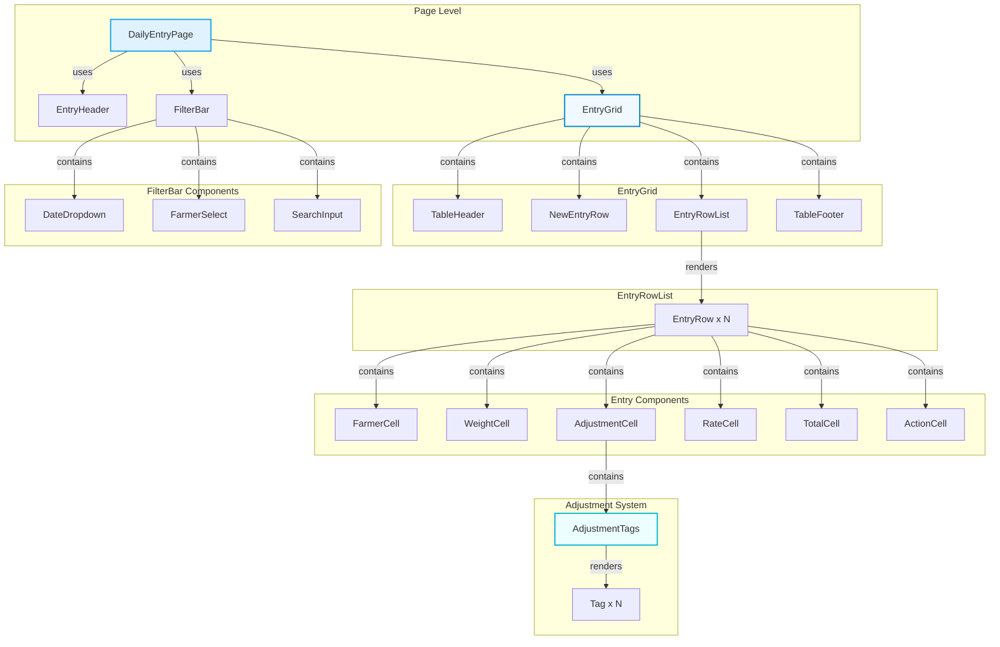
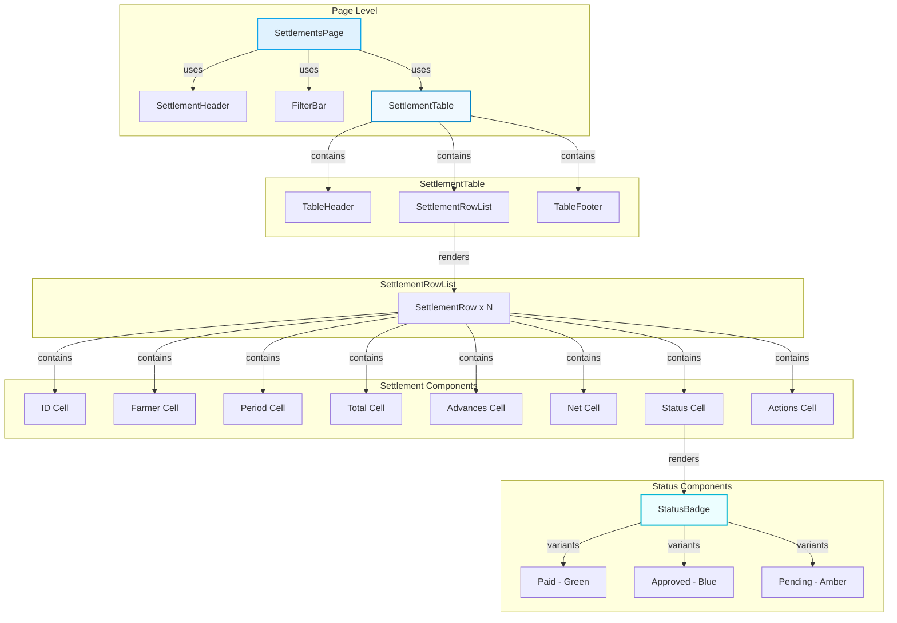
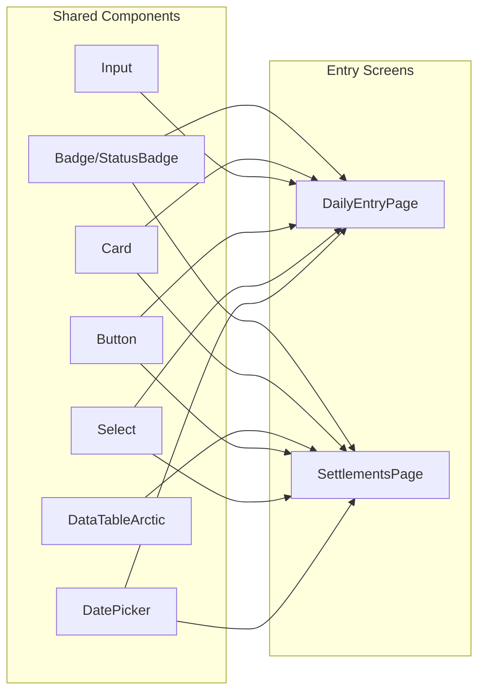

# Arctic Frost Theme UI Redesign - Design Specification

## Document Overview

This specification defines the component architecture for redesigning the **Daily Entry** and **Monthly Settlement** screens using the Arctic Frost design system. The Arctic Frost theme provides a crisp, high-contrast interface optimized for early morning (4-9 AM) market operations with 50+ farmers.

---

## Table of Contents

1. [Design System Specifications](#design-system-specifications)
2. [Component Hierarchy](#component-hierarchy)
3. [Tailwind Color Token Extensions](#tailwind-color-token-extensions)
4. [Component Specifications](#component-specifications)
5. [Interaction Patterns - Adjustment Tags](#interaction-patterns---adjustment-tags)
6. [File Structure](#file-structure)
7. [Bilingual Support Considerations](#bilingual-support-considerations)
8. [Responsive Design Patterns](#responsive-design-patterns)

---

## 1. Design System Specifications

### 1.1 Color Palette - Arctic Frost Theme

The Arctic Frost theme is built around cool, crisp colors inspired by frozen landscapes:

| Token | Hex Code | Usage | WCAG Contrast |
|-------|----------|-------|---------------|
| **Backgrounds** |
| `arctic-ice` | `#FFFFFF` | Primary background | - |
| `arctic-snow` | `#F8FAFC` | Secondary background, cards | - |
| `arctic-frost` | `#F1F5F9` | Subtle sections | - |
| **Interactive** |
| `glacier-cyan` | `#ECFEFF` | Active row highlight | 4.5:1 on white |
| `glacier-500` | `#3B82F6` | Primary actions | 4.5:1 on white |
| **Borders** |
| `ice-border` | `#EAECF0` | Card borders, dividers | - |
| `ice-border-dark` | `#CBD5E1` | Hover states | - |
| **Primary Actions** |
| `frost-blue` | `linear-gradient(135deg, #60A5FA 0%, #3B82F6 100%)` | Buttons, CTAs | - |
| **Status Colors** |
| `aurora-green` | `#10B981` | Paid/success status | 4.5:1 on white |
| `aurora-green-bg` | `#D1FAE5` | Success background | - |
| `frostbite-red` | `#EF4444` | Late/deduction status | 4.5:1 on white |
| `frostbite-red-bg` | `#FEE2E2` | Error/deduction background | - |
| **Typography** |
| `cool-gray-900` | `#1F2937` | Primary text | 15:1 |
| `cool-gray-500` | `#6B7280` | Table headers, muted text | 4.5:1 |

### 1.2 Typography Specifications

| Element | Font | Size | Weight | Line Height |
|---------|------|------|--------|-------------|
| Table Headers | Inter | 12px | 600 (Semibold) | 1.4 |
| Body Text | Inter | 14px | 400 (Regular) | 1.5 |
| Financial Numbers | JetBrains Mono | 14px | 500 (Medium) | 1 |
| Hero Values (Total) | Inter | 24px | 700 (Bold) | 1.2 |
| Tags/Badges | Inter | 11px | 500 (Medium) | 1 |

### 1.3 Spacing & Density Targets

- **Row Height Target**: 40-48px (compact for data density)
- **Visible Rows**: 15-20 entries without scrolling
- **Table Cell Padding**: 12px horizontal, 10px vertical
- **Card Padding**: 16px
- **Component Gap**: 8px (compact), 16px (standard)

---

## 2. Component Hierarchy

### 2.1 Daily Entry Screen Component Tree



### 2.2 Monthly Settlement Screen Component Tree



### 2.3 Shared Component Dependencies



---

## 3. Tailwind Color Token Extensions

### 3.1 New Color Token Definitions

Add these tokens to `tailwind.config.arctic.js`:

```javascript
// In theme.extend.colors:

// ============================================
// ARCTIC FROST THEME - Complete Color Palette
// ============================================

arctic: {
  // Backgrounds - The Frozen Surface
  ice: '#FFFFFF',       // Primary background
  snow: '#F8FAFC',      // Secondary background
  frost: '#F1F5F9',     // Tertiary/sections
  mist: '#E2E8F0',      // Disabled states
  
  // Interactive States - Glacier Cyan
  glacier: {
    50: '#ECFEFF',      // Active row highlight
    100: '#DBEAFE',     // Hover states
    200: '#BFDBFE',     // Focus rings
    300: '#93C5FD',     // Active elements
    400: '#60A5FA',     // Primary gradient start
    500: '#3B82F6',     // Primary actions
    600: '#2563EB',     // Primary gradient end
    700: '#1D4ED8',     // Pressed states
    800: '#1E40AF',     // Deep accent
    900: '#1E3A8A',     // Strong borders
  },
  
  // Borders - Subtle Gray
  border: {
    DEFAULT: '#EAECF0', // Default border
    hover: '#CBD5E1',  // Hover border
    active: '#3B82F6', // Focus/active border
    strong: '#94A3B8', // Strong dividers
  },
  
  // Status Colors - Financial Indicators
  status: {
    // Success - Aurora Green
    success: '#10B981',
    'success-light': '#D1FAE5',
    'success-dark': '#059669',
    
    // Warning - Amber
    warning: '#F59E0B',
    'warning-light': '#FEF3C7',
    'warning-dark': '#D97706',
    
    // Error - Frostbite Red
    error: '#EF4444',
    'error-light': '#FEE2E2',
    'error-dark': '#DC2626',
    
    // Info - Glacier Blue
    info: '#3B82F6',
    'info-light': '#DBEAFE',
    'info-dark': '#2563EB',
  },
  
  // Typography - Cool Gray
  text: {
    primary: '#1F2937',    // Primary text (15:1 contrast)
    secondary: '#4B5563',  // Secondary text
    muted: '#6B7280',      // Table headers, muted (4.5:1)
    disabled: '#9CA3AF',   // Disabled text
    inverse: '#FFFFFF',    // Text on dark backgrounds
  },
}

// Extend spacing for compact rows
spacing: {
  '10': '2.5rem',    // 40px - compact row
  '12': '3rem',      // 48px - standard row
  '0.5': '0.125rem', // 2px - tight spacing
}

// Extend font size for typography scale
fontSize: {
  '2xs': ['0.6875rem', { lineHeight: '1', fontWeight: '500' }],  // 11px - tags
  'xs': ['0.75rem', { lineHeight: '1.4', fontWeight: '500' }],    // 12px - headers
  'sm': ['0.875rem', { lineHeight: '1.5', fontWeight: '400' }],   // 14px - body
  'base': ['1rem', { lineHeight: '1.5', fontWeight: '400' }],     // 16px - large body
  'hero': ['1.5rem', { lineHeight: '1.2', fontWeight: '700' }],   // 24px - totals
  'stat': ['1.75rem', { lineHeight: '1', fontWeight: '700' }],     // 28px - stats
}

// Extend border radius
borderRadius: {
  'arctic': '8px',     // Default
  'arctic-lg': '12px', // Cards
  'arctic-sm': '6px',   // Tags/badges
  'arctic-full': '9999px', // Pills
}

// Extend box shadows for frost effect
boxShadow: {
  'frost-sm': '0 1px 2px rgba(0, 0, 0, 0.05)',
  'frost-md': '0 4px 6px rgba(0, 0, 0, 0.07), 0 2px 4px rgba(0, 0, 0, 0.05)',
  'frost-lg': '0 10px 15px rgba(0, 0, 0, 0.1), 0 4px 6px rgba(0, 0, 0, 0.05)',
  'frost-card': '0 1px 3px rgba(0, 0, 0, 0.1), 0 1px 2px rgba(0, 0, 0, 0.06)',
  'frost-focus': '0 0 0 3px rgba(59, 130, 246, 0.2)',
}
```

### 3.2 CSS Variables (arctic-frost.css extension)

Add these to the CSS custom properties:

```css
/* Compact row heights */
:root {
  --af-row-height-compact: 40px;
  --af-row-height-standard: 48px;
  --af-cell-padding-x: 12px;
  --af-cell-padding-y: 10px;
  
  /* New color variables */
  --af-glacier-cyan: #ECFEFF;
  --af-ice-white: #FFFFFF;
  --af-border-subtle: #EAECF0;
  --af-border-hover: #CBD5E1;
  
  /* Status backgrounds */
  --af-success-bg: #D1FAE5;
  --af-error-bg: #FEE2E2;
  --af-warning-bg: #FEF3C7;
  --af-info-bg: #DBEAFE;
}
```

---

## 4. Component Specifications

### 4.1 EntryGridArctic (Enhanced)

**Location**: `frontend/src/components/entry/EntryGridArctic.jsx`

**Props Interface**:
```typescript
interface EntryGridProps {
  entries: Entry[];
  farmers: Farmer[];
  currentRate: number;
  onAddEntry: (entry: Entry) => void;
  onUpdateEntry: (entry: Entry) => void;
  onDeleteEntry: (id: string) => void;
  loading?: boolean;
  
  // New props for enhanced functionality
  selectedDate?: string;
  onDateChange?: (date: string) => void;
  filterFarmerId?: string;
  onFilterFarmerChange?: (farmerId: string) => void;
  searchTerm?: string;
  onSearchChange?: (term: string) => void;
}
```

**Styling Approach**:
- Use existing `af-bg-frost-lg` class for frosted glass container
- Table uses `af-grid` layout with fixed column widths
- Active row uses `af-grid-row-active` with glacier-cyan highlight
- Responsive: `overflow-x-auto` for horizontal scroll on small screens

**Responsive Breakpoints**:
| Breakpoint | Width | Behavior |
|------------|-------|----------|
| Mobile | < 640px | Card list view, collapsible columns |
| Tablet | 640-1024px | Horizontal scroll table |
| Desktop | > 1024px | Full-width table, all columns visible |

### 4.2 EntryRowArctic (Enhanced)

**Location**: `frontend/src/components/entry/EntryRowArctic.jsx`

**Props Interface**:
```typescript
interface EntryRowProps {
  entry: Entry;
  farmers: Farmer[];
  currentRate: number;
  onUpdate: (entry: Entry) => void;
  onDelete: (id: string) => void;
  isSaved?: boolean;
  isSaving?: boolean;
  isNew?: boolean;
  isActive?: boolean;
  onActivate?: () => void;
  onDeactivate?: () => void;
  
  // Compact mode for 40-48px row height
  compact?: boolean;
}
```

**Styling Approach**:
- Row height: `min-h-[40px]` (compact), `min-h-[48px]` (standard)
- Background: alternating `bg-white` and `bg-arctic-frost`
- Hover: `hover:bg-glacier-cyan-50` transition
- Active: `bg-glacier-cyan-100` with left border accent
- Cell content uses `tabular-nums` for financial alignment

### 4.3 AdjustmentTags

**Location**: `frontend/src/components/entry/AdjustmentTags.jsx`

**Props Interface**:
```typescript
interface AdjustmentTagsProps {
  adjustments: string[];
  onToggle: (adjustment: string) => void;
  disabled?: boolean;
  compact?: boolean;
  size?: 'sm' | 'md' | 'lg';
}

interface AdjustmentOption {
  key: string;
  label: string;
  labelTa?: string; // Tamil translation key
  type: 'bonus' | 'deduction';
  percentage: number;
  color?: string;
}
```

**Styling Approach**:
```jsx
// Tag base styles
const tagBase = `
  inline-flex items-center gap-1
  px-2 py-0.5 rounded-full
  text-xs font-medium
  transition-all duration-150
  cursor-pointer select-none
  border
`;

// Deduction tag (Frostbite Red)
const deductionStyle = `
  bg-frostbite-red-bg
  text-frostbite-red
  border-frostbite-red/30
  hover:border-frostbite-red hover:bg-frostbite-red/10
`;

// Bonus tag (Aurora Green)
const bonusStyle = `
  bg-aurora-green-bg
  text-aurora-green
  border-aurora-green/30
  hover:border-aurora-green hover:bg-aurora-green/10
`;

// Selected state
const selectedStyle = `
  ring-2 ring-offset-1
`;
```

**Interaction States**:
| State | Visual | Behavior |
|-------|--------|----------|
| Default | Semi-transparent background | Clickable |
| Hover | Full color background | Cursor pointer |
| Active/Selected | Ring + full background | Toggle off on click |
| Disabled | 40% opacity | No interaction |

### 4.4 DataTableArctic (Settlement Table)

**Location**: `frontend/src/components/data/DataTableArctic.jsx` (existing)

**Enhanced Props for Settlement**:
```typescript
interface SettlementTableProps {
  columns: Column[];
  data: Settlement[];
  loading?: boolean;
  emptyMessage?: string;
  onRowClick?: (row: Settlement) => void;
  sortable?: boolean;
  searchable?: boolean;
  pagination?: boolean;
  pageSize?: number;
  
  // Settlement-specific
  onApprove?: (settlement: Settlement) => void;
  onMarkPaid?: (settlement: Settlement) => void;
  onDownload?: (settlement: Settlement) => void;
}
```

### 4.5 FilterBar Component

**Location**: `frontend/src/components/entry/FilterBar.jsx` (new)

**Props Interface**:
```typescript
interface FilterBarProps {
  // Date filters
  selectedDate?: string;
  dateRange?: { start: string; end: string };
  onDateChange?: (date: string) => void;
  onDateRangeChange?: (range: { start: string; end: string }) => void;
  
  // Farmer filter
  farmers?: Farmer[];
  selectedFarmerId?: string;
  onFarmerChange?: (farmerId: string) => void;
  
  // Search
  searchTerm?: string;
  onSearchChange?: (term: string) => void;
  placeholder?: string;
  
  // Actions
  onRefresh?: () => void;
  onExport?: () => void;
}
```

**Styling Approach**:
```jsx
// Filter bar container
<div className="
  flex flex-wrap items-center gap-3
  p-4 mb-4
  bg-white rounded-lg
  border border-arctic-border
  shadow-frost-sm
">
  {/* Date Picker */}
  <div className="flex items-center gap-2">
    <label className="text-sm text-cool-gray-500">Date:</label>
    <input 
      type="date"
      className="
        px-3 py-2 text-sm
        bg-arctic-frost rounded-md
        border border-arctic-border
        focus:border-glacier-500 focus:ring-2 focus:ring-glacier-200
      "
    />
  </div>
  
  {/* Farmer Select */}
  <select className="
    px-3 py-2 text-sm
    bg-arctic-frost rounded-md
    border border-arctic-border
  ">
    <option value="">All Farmers</option>
  </select>
  
  {/* Search */}
  <div className="relative flex-1 min-w-[200px]">
    <input 
      type="search"
      placeholder="Search..."
      className="
        w-full px-4 py-2 pl-10 text-sm
        bg-arctic-frost rounded-md
        border border-arctic-border
      "
    />
  </div>
</div>
```

### 4.6 StatusBadge Component

**Location**: `frontend/src/components/data/StatusBadge.jsx` (existing, enhanced)

**Variants**:
```typescript
type StatusVariant = 'paid' | 'approved' | 'generated' | 'pending';

const statusStyles = {
  paid: {
    bg: 'bg-aurora-green-bg',
    text: 'text-aurora-green',
    border: 'border-aurora-green/30',
    icon: Check,
  },
  approved: {
    bg: 'bg-glacier-100',
    text: 'text-glacier-700',
    border: 'border-glacier-300',
    icon: CheckCircle,
  },
  generated: {
    bg: 'bg-amber-50',
    text: 'text-amber-700',
    border: 'border-amber-300',
    icon: Clock,
  },
  pending: {
    bg: 'bg-gray-50',
    text: 'text-gray-600',
    border: 'border-gray-200',
    icon: AlertCircle,
  },
};
```

---

## 5. Interaction Patterns - Adjustment Tags

### 5.1 Adjustment Tag Design Concept

Transform the "handwritten scribbles" concept into clickable, visually distinct tags:

```
┌─────────────────────────────────────────────────────────────┐
│  ADJUSTMENT TYPE    │  COLOR        │  PERCENTAGE          │
├─────────────────────┼───────────────┼──────────────────────┤
│  Late Delivery      │ Frostbite Red │  -5% (deduction)     │
│  Wet Flowers        │ Frostbite Red │  -10% (deduction)    │
│  Premium Quality    │ Aurora Green  │  +10% (bonus)        │
│  First Delivery     │ Aurora Green  │  +2% (bonus)        │
│  Bonus              │ Aurora Green  │  +5% (bonus)        │
└─────────────────────┴───────────────┴──────────────────────┘
```

### 5.2 Interaction Flow

```mermaid
stateDiagram-v2
    [*] --> Default
    
    Default --> Clicked: User clicks tag
    Clicked --> Selected: Toggle on
    
    Selected --> Clicked: User clicks again
    Clicked --> Default: Toggle off
    
    Default --> Hover: Mouse enters
    Hover --> Default: Mouse leaves
    
    Selected --> Disabled: Form submission
    Disabled --> [*]
```

### 5.3 Keyboard Navigation

- **Tab**: Move between adjustment tags
- **Enter/Space**: Toggle tag selection
- **Escape**: Clear all selections

### 5.4 Accessibility Requirements

```jsx
// ARIA attributes for screen readers
<button
  role="checkbox"
  aria-checked={isSelected}
  aria-label="Late delivery, 5% deduction"
  tabIndex={0}
>
  <span className="sr-only">Late Delivery</span>
  <span>-5%</span>
</button>
```

### 5.5 Implementation Pattern

```jsx
const AdjustmentTags = ({ adjustments, onToggle, disabled, size = 'md' }) => {
  const adjustmentOptions = [
    { key: 'late', label: 'Late', type: 'deduction', percentage: -5 },
    { key: 'wet', label: 'Wet', type: 'deduction', percentage: -10 },
    { key: 'bonus', label: 'Bonus', type: 'bonus', percentage: 5 },
    { key: 'premium', label: 'Premium', type: 'bonus', percentage: 10 },
    { key: 'first_time', label: 'First', type: 'bonus', percentage: 2 },
  ];

  const sizeClasses = {
    sm: 'px-1.5 py-0.5 text-2xs',
    md: 'px-2 py-0.5 text-xs',
    lg: 'px-2.5 py-1 text-sm',
  };

  return (
    <div className="flex flex-wrap gap-1.5">
      {adjustmentOptions.map((adj) => {
        const isSelected = adjustments.includes(adj.key);
        const isDeduction = adj.type === 'deduction';
        
        return (
          <button
            key={adj.key}
            type="button"
            onClick={() => !disabled && onToggle(adj.key)}
            disabled={disabled}
            className={`
              inline-flex items-center gap-1
              ${sizeClasses[size]}
              rounded-full font-medium
              transition-all duration-150
              border
              ${isSelected 
                ? (isDeduction 
                    ? 'bg-frostbite-red-bg text-frostbite-red border-frostbite-red/50' 
                    : 'bg-aurora-green-bg text-aurora-green border-aurora-green/50')
                : 'bg-white text-cool-gray-500 border-arctic-border hover:border-cool-gray-300'
              }
              ${disabled ? 'opacity-50 cursor-not-allowed' : 'cursor-pointer'}
            `}
            aria-pressed={isSelected}
          >
            <span>{adj.label}</span>
            <span className={isSelected ? 'font-semibold' : ''}>
              {adj.percentage > 0 ? '+' : ''}{adj.percentage}%
            </span>
          </button>
        );
      })}
    </div>
  );
};
```

---

## 6. File Structure

### 6.1 Component File Organization

```
frontend/src/
├── components/
│   ├── entry/
│   │   ├── EntryGridArctic.jsx      # Main entry grid (enhanced)
│   │   ├── EntryRowArctic.jsx        # Individual entry row (enhanced)
│   │   ├── AdjustmentTags.jsx        # NEW - Adjustment tag system
│   │   ├── FilterBar.jsx            # NEW - Date/farmer filters
│   │   ├── FarmerSelect.jsx          # Farmer dropdown (enhanced)
│   │   └── WeightInput.jsx          # Weight input (existing)
│   │
│   ├── settlement/                   # NEW - Settlement components
│   │   ├── SettlementTable.jsx      # Main settlement table
│   │   ├── SettlementRow.jsx        # Individual settlement row
│   │   ├── SettlementSummary.jsx    # Summary cards
│   │   └── SettlementActions.jsx    # Approve/Pay/Download
│   │
│   ├── data/
│   │   ├── DataTableArctic.jsx      # Base table (enhanced)
│   │   ├── Card.jsx                 # Card component
│   │   ├── Badge.jsx                # Status badges
│   │   └── StatusIndicator.jsx      # Status dots
│   │
│   ├── layout/
│   │   ├── Header.jsx
│   │   ├── Sidebar.jsx
│   │   └── Breadcrumb.jsx           # NEW - Navigation breadcrumb
│   │
│   └── forms/
│       ├── DatePicker.jsx
│       ├── Select.jsx
│       ├── Input.jsx
│       └── Button.jsx
│
├── pages/
│   ├── DailyEntryPage.jsx           # Updated with new components
│   └── SettlementsPage.jsx          # Updated with new components
│
├── hooks/
│   ├── useDailyEntries.js            # Enhanced with filters
│   ├── useSettlements.js             # Enhanced with filters
│   └── useFilterState.js             # NEW - Filter state management
│
├── i18n/
│   ├── en.json                       # English translations
│   └── ta.json                       # Tamil translations
│
└── styles/
    ├── arctic-frost.css              # Enhanced CSS variables
    └── arctic.css                   # Legacy styles
```

### 6.2 New File Requirements

| File | Purpose | Priority |
|------|---------|----------|
| `AdjustmentTags.jsx` | Clickable adjustment tags | P0 |
| `FilterBar.jsx` | Date/farmer/search filters | P0 |
| `Breadcrumb.jsx` | Navigation breadcrumb | P1 |
| `SettlementTable.jsx` | Settlement data table | P0 |
| `SettlementRow.jsx` | Settlement row | P0 |
| `SettlementSummary.jsx` | Summary statistics | P1 |
| `useFilterState.js` | Filter state hook | P1 |

---

## 7. Bilingual Support Considerations

### 7.1 Translation Key Structure

```json
{
  "dailyEntry": {
    "title": "Daily Entry",
    "titleTa": "தினசரி பதிவு",
    "columns": {
      "date": "Date",
      "dateTa": "தேதி",
      "farmer": "Farmer",
      "farmerTa": "விவசாயி",
      "flowerType": "Flower Type",
      "flowerTypeTa": "மலர் வகை",
      "weight": "Weight (g)",
      "weightTa": "எடை (கி)",
      "marketRate": "Market Rate",
      "marketRateTa": "சந்தை விலை",
      "adjustment": "Adjustment",
      "adjustmentTa": "மாற்றம்",
      "finalTotal": "Final Total",
      "finalTotalTa": " இறுதி மொத்தம்"
    },
    "adjustments": {
      "late": "Late",
      "lateTa": "தாமதம்",
      "wet": "Wet",
      "wetTa": "ஈரம்",
      "bonus": "Bonus",
      "bonusTa": "போனஸ்",
      "premium": "Premium",
      "premiumTa": "பிரீமியம்",
      "firstTime": "First",
      "firstTimeTa": "முதல்"
    }
  },
  "settlements": {
    "title": "Monthly Settlement",
    "titleTa": "மாதாந்திர தீர்வு",
    "status": {
      "paid": "Paid",
      "paidTa": "செலுத்தப்பட்டது",
      "approved": "Approved",
      "approvedTa": "அங்கீகரிக்கப்பட்டது",
      "generated": "Generated",
      "generatedTa": "உருவாக்கப்பட்டது"
    }
  }
}
```

### 7.2 Implementation Pattern

```jsx
import { useTranslation } from 'react-i18next';

const AdjustmentTags = ({ adjustments, onToggle }) => {
  const { t, i18n } = useTranslation();
  const isTamil = i18n.language === 'ta';

  const adjustmentOptions = [
    { 
      key: 'late', 
      label: isTamil ? t('dailyEntry.adjustments.lateTa') : t('dailyEntry.adjustments.late'),
      type: 'deduction', 
      percentage: -5 
    },
    // ... more options
  ];

  return (
    <div className="flex gap-1">
      {adjustmentOptions.map((adj) => (
        <button key={adj.key}>
          {adj.label}
        </button>
      ))}
    </div>
  );
};
```

### 7.3 Tamil-Specific Considerations

- **Font**: Use `Noto Sans Tamil` for proper rendering
- **Date Format**: DD-MM-YYYY (configurable)
- **Currency**: ₹ symbol works in Tamil
- **Text Direction**: LTR (no RTL required for Tamil)
- **Character Width**: Tamil characters are wider - allow 20% more horizontal space

---

## 8. Responsive Design Patterns

### 8.1 Breakpoint Strategy

```javascript
const breakpoints = {
  sm: '640px',   // Large phones
  md: '768px',   // Tablets portrait
  lg: '1024px',  // Tablets landscape / Small laptops
  xl: '1280px',  // Desktops
};
```

### 8.2 Desktop View (≥1024px)

Full table with all columns visible:

```
┌─────────────────────────────────────────────────────────────────────────────┐
│ Date  │ Farmer Name      │ Flower │ Weight │ Rate  │ Adjustment │ Total    │
├───────┼──────────────────┼────────┼────────┼───────┼────────────┼──────────┤
│ ...   │ ...              │ ...    │ ...    │ ...   │ [+Bonus]   │ ₹150.00  │
│ ...   │ ...              │ ...    │ ...    │ ...   │ [-Late]    │ ₹142.50  │
└───────┴──────────────────┴────────┴────────┴───────┴────────────┴──────────┘
```

### 8.3 Tablet View (768-1024px)

Horizontal scroll with sticky first column:

```
┌─────────────────────────────────────────────────────────────────────┐
│ ───── │ Date  │ Farmer Name      │ Weight │ Total    │ Adjustment │
├───────┼───────┼──────────────────┼────────┼──────────┼────────────┤
│ ⋮     │ ...   │ ...              │ ...    │ ₹150.00  │ [+Bonus]   │
└───────┴───────┴──────────────────┴────────┴──────────┴────────────┘
         └─ Sticky ─┘
```

### 8.4 Mobile View (<768px)

Card list view with collapsible details:

```
┌─────────────────────────────┐
│ 📅 17 Feb 2026              │
│ 👤 Ramasamy                 │
│ 🌸 Rose      5.2kg  ₹156.00 │
│ [+Bonus -5%]                │
├─────────────────────────────┤
│ 📅 17 Feb 2026              │
│ 👤 Kumar                   │
│ 🌸 Jasmine   3.1kg  ₹93.00  │
│ [Late -5%]                  │
├─────────────────────────────┤
│ 📅 17 Feb 2026              │
│ 👤 Muthu                   │
│ 🌸 Marigold  8.0kg  ₹240.00 │
│ []                          │
└─────────────────────────────┘
```

### 8.5 Responsive Component Pattern

```jsx
const EntryRow = ({ entry, isMobile }) => {
  if (isMobile) {
    return (
      <div className="
        p-4 mb-3
        bg-white rounded-lg
        border border-arctic-border
        shadow-frost-sm
      ">
        {/* Card layout for mobile */}
        <div className="flex justify-between items-start mb-2">
          <span className="font-medium">{entry.farmerName}</span>
          <span className="text-hero font-bold">₹{entry.total}</span>
        </div>
        <div className="flex gap-4 text-sm text-cool-gray-500">
          <span>{entry.date}</span>
          <span>{entry.flowerType}</span>
          <span>{entry.weight}kg</span>
        </div>
        <AdjustmentTags adjustments={entry.adjustments} compact />
      </div>
    );
  }

  // Table row for desktop
  return (
    <tr className="hover:bg-glacier-50">
      <td className="px-3 py-2.5">{entry.date}</td>
      <td className="px-3 py-2.5">{entry.farmerName}</td>
      {/* ... */}
    </tr>
  );
};
```

### 8.6 Responsive Hook

```javascript
import { useMediaQuery } from './hooks/useMediaQuery';

const DailyEntryPage = () => {
  const isMobile = useMediaQuery('(max-width: 767px)');
  const isTablet = useMediaQuery('(min-width: 768px) and (max-width: 1023px)');
  const isDesktop = useMediaQuery('(min-width: 1024px)');

  return (
    <div>
      {isMobile && <MobileEntryView />}
      {isTablet && <TabletEntryView />}
      {isDesktop && <DesktopEntryView />}
    </div>
  );
};
```

---

## 9. Implementation Checklist

### Phase 1: Foundation
- [ ] Update Tailwind config with new color tokens
- [ ] Extend CSS variables in arctic-frost.css
- [ ] Create AdjustmentTags component
- [ ] Create FilterBar component
- [ ] Add translation keys for new components

### Phase 2: Daily Entry Screen
- [ ] Enhance EntryGridArctic with filters
- [ ] Enhance EntryRowArctic with compact mode
- [ ] Update DailyEntryPage with new components
- [ ] Implement responsive table/card toggle
- [ ] Add keyboard navigation

### Phase 3: Settlement Screen
- [ ] Create SettlementTable component
- [ ] Create SettlementRow component
- [ ] Create SettlementSummary cards
- [ ] Update SettlementsPage with new components
- [ ] Implement status badge interactions

### Phase 4: Polish
- [ ] Add entrance animations
- [ ] Implement reduced-motion support
- [ ] Test with Tamil translations
- [ ] Verify offline-first behavior
- [ ] Performance optimization

---

## Appendix A: Migration from Existing Code

### A.1 Existing Component Mapping

| Existing Component | New/Enhanced Component | Changes |
|-------------------|------------------------|---------|
| `EntryGridArctic.jsx` | `EntryGridArctic.jsx` | Add filter props |
| `EntryRowArctic.jsx` | `EntryRowArctic.jsx` | Add compact mode |
| - | `AdjustmentTags.jsx` | **NEW** |
| - | `FilterBar.jsx` | **NEW** |
| `DataTableArctic.jsx` | `DataTableArctic.jsx` | Add settlement events |
| `Badge.jsx` | `StatusBadge.jsx` | Enhanced variants |

### A.2 CSS Class Migration

| Old Class | New Class | Notes |
|-----------|-----------|-------|
| `af-bg-frost-lg` | `bg-white border border-arctic-border` | New theme |
| `af-grid-row-active` | `bg-glacier-cyan` | New color token |
| `af-text-error` | `text-frostbite-red` | New color token |
| `af-text-success` | `text-aurora-green` | New color token |

---

## Appendix B: Accessibility Checklist

- [ ] All interactive elements keyboard accessible
- [ ] Focus indicators visible (3px ring)
- [ ] Color contrast ≥4.5:1 for text
- [ ] Screen reader announcements for status changes
- [ ] Reduced motion support (`prefers-reduced-motion`)
- [ ] Touch targets ≥44x44px on mobile
- [ ] ARIA labels on all icon-only buttons
- [ ] Form labels associated with inputs

---

*Document Version: 1.0*  
*Last Updated: 2026-02-17*  
*Author: Architect Mode - Design Specification*
