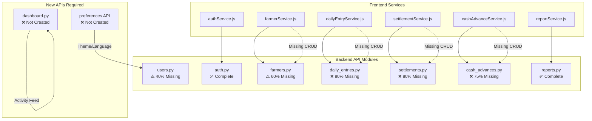

# API Audit Report - Malar Market Ledger

## Executive Summary

This report documents a comprehensive audit of the backend API modules, frontend service layers, and their alignment with the UI redesign requirements. The audit reveals significant gaps between the documented API design ([`docs/api-design.md`](docs/api-design.md)) and actual implementation, as well as missing endpoints required for the new UI features.

---

## 1. Backend API Implementation Status

### 1.1 Module-by-Module Analysis

| Module | File | Documented Endpoints | Implemented | Gap % |
|--------|------|---------------------|-------------|-------|
| **Auth** | [`backend/app/api/auth.py`](backend/app/api/auth.py) | 5 | 5 | 0% |
| **Users** | [`backend/app/api/users.py`](backend/app/api/users.py) | 5 | 2 | 60% |
| **Farmers** | [`backend/app/api/farmers.py`](backend/app/api/farmers.py) | 5 | 2 | 60% |
| **Daily Entries** | [`backend/app/api/daily_entries.py`](backend/app/api/daily_entries.py) | 5 | 1 | 80% |
| **Settlements** | [`backend/app/api/settlements.py`](backend/app/api/settlements.py) | 5 | 1 | 80% |
| **Cash Advances** | [`backend/app/api/cash_advances.py`](backend/app/api/cash_advances.py) | 4 | 1 | 75% |
| **Reports** | [`backend/app/api/reports.py`](backend/app/api/reports.py) | 10+ | 10+ | 0% |
| **Notifications** | [`backend/app/api/notifications.py`](backend/app/api/notifications.py) | TBD | TBD | TBD |
| **System Settings** | [`backend/app/api/system_settings.py`](backend/app/api/system_settings.py) | TBD | TBD | TBD |
| **WhatsApp** | [`backend/app/api/whatsapp.py`](backend/app/api/whatsapp.py) | TBD | TBD | TBD |

### 1.2 Critical API Gaps by Module

#### Auth Module - COMPLETE ✓
| Endpoint | Status | Notes |
|----------|--------|-------|
| `POST /auth/login` | ✅ Implemented | Returns JWT tokens with user data |
| `POST /auth/refresh` | ✅ Implemented | Token rotation working |
| `POST /auth/logout` | ✅ Implemented | Audit logging included |
| `POST /auth/forgot-password` | ✅ Implemented | Returns reset token in dev mode |
| `POST /auth/reset-password` | ✅ Implemented | Validates token expiry |

#### Users Module - 40% INCOMPLETE
| Endpoint | Status | Notes |
|----------|--------|-------|
| `GET /users` | ✅ Implemented | Admin only, basic fields |
| `GET /users/{user_id}` | ❌ Missing | Documented but not implemented |
| `POST /users` | ❌ Missing | Admin user creation |
| `PUT /users/{user_id}` | ❌ Missing | User update |
| `DELETE /users/{user_id}` | ❌ Missing | Soft delete user |
| `GET /me` | ✅ Implemented | Current user info |

#### Farmers Module - 60% INCOMPLETE
| Endpoint | Status | Notes |
|----------|--------|-------|
| `GET /farmers` | ✅ Implemented | Basic list, no pagination |
| `GET /farmers/{farmer_id}` | ✅ Implemented | Returns farmer object |
| `POST /farmers` | ❌ Missing | Farmer creation |
| `PUT /farmers/{farmer_id}` | ❌ Missing | Farmer update |
| `DELETE /farmers/{farmer_id}` | ❌ Missing | Soft delete farmer |
| `GET /farmers/{farmer_id}/balance` | ❌ Missing | Balance endpoint |
| `GET /farmers/search` | ❌ Missing | Search functionality |

#### Daily Entries Module - 80% INCOMPLETE
| Endpoint | Status | Notes |
|----------|--------|-------|
| `GET /daily-entries` | ✅ Implemented | Basic list, farmer_id filter |
| `GET /daily-entries/{entry_id}` | ❌ Missing | Single entry detail |
| `POST /daily-entries` | ❌ Missing | Create entry with auto-calculations |
| `PUT /daily-entries/{entry_id}` | ❌ Missing | Update entry |
| `DELETE /daily-entries/{entry_id}` | ❌ Missing | Soft delete entry |
| `GET /daily-entries/summary` | ❌ Missing | Daily summary for dashboard |

#### Settlements Module - 80% INCOMPLETE
| Endpoint | Status | Notes |
|----------|--------|-------|
| `GET /settlements` | ✅ Implemented | Basic list |
| `GET /settlements/{settlement_id}` | ❌ Missing | Single settlement with items |
| `POST /settlements/generate` | ❌ Missing | Generate settlement |
| `PUT /settlements/{settlement_id}/approve` | ❌ Missing | Approve settlement |
| `PUT /settlements/{settlement_id}/pay` | ❌ Missing | Mark as paid |

#### Cash Advances Module - 75% INCOMPLETE
| Endpoint | Status | Notes |
|----------|--------|-------|
| `GET /cash-advances` | ✅ Implemented | Basic list |
| `POST /cash-advances` | ❌ Missing | Create advance request |
| `PUT /cash-advances/{advance_id}/approve` | ❌ Missing | Approve advance |
| `PUT /cash-advances/{advance_id}/reject` | ❌ Missing | Reject advance |

---

## 2. Frontend Service Layer Analysis

### 2.1 Service-to-API Alignment

| Service | File | Expected Endpoints | Backend Status |
|---------|------|-------------------|----------------|
| **authService** | [`frontend/src/services/authService.js`](frontend/src/services/authService.js) | 6 | 5/6 implemented |
| **farmerService** | [`frontend/src/services/farmerService.js`](frontend/src/services/farmerService.js) | 6 | 2/6 implemented |
| **dailyEntryService** | [`frontend/src/services/dailyEntryService.js`](frontend/src/services/dailyEntryService.js) | 8 | 1/8 implemented |
| **settlementService** | [`frontend/src/services/settlementService.js`](frontend/src/services/settlementService.js) | TBD | 1/5 implemented |
| **cashAdvanceService** | [`frontend/src/services/cashAdvanceService.js`](frontend/src/services/cashAdvanceService.js) | TBD | 1/4 implemented |
| **reportService** | [`frontend/src/services/reportService.js`](frontend/src/services/reportService.js) | TBD | Most implemented |

### 2.2 Frontend Services Expecting Missing APIs

#### authService.js
```javascript
// MISSING: GET /auth/me (calls /auth/me but backend has /me)
export const getCurrentUser = async () => {
  return handleApiResponse(api.get('/auth/me')); // Should be /me
};

// MISSING: POST /auth/change-password
export const changePassword = async (data) => {
  return handleApiResponse(api.post('/auth/change-password', data));
};
```

#### farmerService.js
```javascript
// MISSING: POST /farmers
export const createFarmer = async (data) => {
  return handleApiResponse(api.post('/farmers', data));
};

// MISSING: PUT /farmers/{id}
export const updateFarmer = async (id, data) => {
  return handleApiResponse(api.put(`/farmers/${id}`, data));
};

// MISSING: DELETE /farmers/{id}
export const deleteFarmer = async (id) => {
  return handleApiResponse(api.delete(`/farmers/${id}`));
};

// MISSING: GET /farmers/search
export const searchFarmers = async (query) => {
  return handleApiResponse(api.get('/farmers/search', { params: { q: query } }));
};
```

#### dailyEntryService.js
```javascript
// MISSING: GET /daily-entries/{id}
export const getDailyEntry = async (id) => {
  return handleApiResponse(api.get(`/daily-entries/${id}`));
};

// MISSING: POST /daily-entries
export const createDailyEntry = async (data) => {
  return handleApiResponse(api.post('/daily-entries', data));
};

// MISSING: PUT /daily-entries/{id}
export const updateDailyEntry = async (id, data) => {
  return handleApiResponse(api.put(`/daily-entries/${id}`, data));
};

// MISSING: DELETE /daily-entries/{id}
export const deleteDailyEntry = async (id) => {
  return handleApiResponse(api.delete(`/daily-entries/${id}`));
};

// MISSING: GET /daily-entries/summary
export const getDailySummary = async (date) => {
  return handleApiResponse(api.get('/daily-entries/summary', { params: { date } }));
};

// MISSING: POST /daily-entries/bulk
export const bulkCreateEntries = async (entries) => {
  return handleApiResponse(api.post('/daily-entries/bulk', { entries }));
};
```

---

## 3. UI Redesign API Requirements

### 3.1 New APIs Required for UI Features

Based on the UI redesign specification ([`specs/001-ui-redesign/spec.md`](specs/001-ui-redesign/spec.md)), the following APIs are needed:

#### FR-007: Login Page Redesign
| API | Purpose | Status |
|-----|---------|--------|
| `POST /auth/login` | Authentication | ✅ Exists |
| `POST /auth/forgot-password` | Password reset flow | ✅ Exists |
| `POST /auth/reset-password` | Password reset confirmation | ✅ Exists |

#### FR-008: Dashboard Enhancement
| API | Purpose | Status |
|-----|---------|--------|
| `GET /reports/daily-summary` | Today's stats | ✅ Exists |
| `GET /reports/market-analytics` | Market trends | ✅ Exists |
| `GET /reports/settlements` | Settlement summary | ✅ Exists |
| `GET /reports/cash-advances` | Advances summary | ✅ Exists |
| **NEW: `GET /dashboard/activity`** | Recent activity feed | ❌ Missing |
| **NEW: `GET /dashboard/quick-stats`** | Aggregated dashboard stats | ❌ Missing |

#### FR-001: Design System - User Preferences
| API | Purpose | Status |
|-----|---------|--------|
| **NEW: `GET /users/me/preferences`** | Get user theme/preferences | ❌ Missing |
| **NEW: `PUT /users/me/preferences`** | Update user preferences | ❌ Missing |

### 3.2 Dashboard Activity Feed API Specification

```yaml
endpoint: GET /api/v1/dashboard/activity
description: Get recent activity for dashboard feed
authentication: Required
response:
  success: true
  data:
    activities:
      - id: "uuid"
        type: "entry_created" | "settlement_approved" | "advance_requested" | "farmer_created"
        description: "Entry created for Raj Kumar - 10.5kg Rose"
        timestamp: "2026-02-17T05:30:00Z"
        user_id: "uuid"
        entity_type: "daily_entry"
        entity_id: "uuid"
    pagination:
      page: 1
      page_size: 10
      total_items: 50
```

### 3.3 User Preferences API Specification

```yaml
endpoint: GET /api/v1/users/me/preferences
description: Get current user preferences including theme settings
authentication: Required
response:
  success: true
  data:
    user_id: "uuid"
    theme: "arctic" | "arctic-dark"
    language: "en" | "ta"
    dashboard_layout: "default" | "compact"
    font_size: "normal" | "large"
    reduced_motion: false

endpoint: PUT /api/v1/users/me/preferences
description: Update user preferences
authentication: Required
request:
  theme: "arctic-dark"
  language: "ta"
  reduced_motion: true
response:
  success: true
  message: "Preferences updated successfully"
```

---

## 4. API Response Format Inconsistencies

### 4.1 Current Implementation Issues

| Module | Issue | Impact |
|--------|-------|--------|
| **farmers.py** | Returns `{"farmers": [...]}` instead of standard envelope | Frontend expects `{"success": true, "data": [...]}` |
| **daily_entries.py** | Returns `{"entries": [...]}` without pagination | No pagination support |
| **settlements.py** | Returns `{"settlements": [...]}` without metadata | Missing total count |
| **cash_advances.py** | Returns `{"advances": [...]}` inconsistent format | Breaks response handlers |

### 4.2 Standard Response Format (from api-design.md)

```json
{
  "success": true,
  "data": [...],
  "pagination": {
    "page": 1,
    "page_size": 20,
    "total_items": 150,
    "total_pages": 8,
    "has_next": true,
    "has_previous": false
  }
}
```

### 4.3 Current Non-Compliant Responses

```python
# farmers.py - Line 23
return {"farmers": [{"id": f.id, "name": f.name, ...} for f in farmers]}

# daily_entries.py - Line 27
return {"entries": [{"id": e.id, "farmer_id": e.farmer_id, ...} for e in entries]}

# settlements.py - Line 27
return {"settlements": [{"id": s.id, "farmer_id": s.farmer_id, ...} for s in settlements]}

# cash_advances.py - Line 27
return {"advances": [{"id": a.id, "farmer_id": a.farmer_id, ...} for a in advances]}
```

---

## 5. Missing Soft Delete Implementation

### 5.1 Modules Missing Soft Delete Filters

The constitution mandates soft deletes with `deleted_at == None` filtering:

| Module | Soft Delete Filter | Status |
|--------|-------------------|--------|
| **farmers.py** | ✅ `Farmer.deleted_at == None` | Implemented |
| **daily_entries.py** | ❌ Missing | Needs fix |
| **settlements.py** | ❌ Missing | Needs fix |
| **cash_advances.py** | ❌ Missing | Needs fix |

---

## 6. Summary of Required API Work

### 6.1 Priority 0 - Critical for UI Redesign

| ID | Task | Module | Effort |
|----|------|--------|--------|
| API-001 | Implement CRUD for farmers | farmers.py | High |
| API-002 | Implement CRUD for daily entries | daily_entries.py | High |
| API-003 | Add soft delete filters | All modules | Low |
| API-004 | Standardize response format | All modules | Medium |
| API-005 | Create dashboard activity endpoint | New: dashboard.py | Medium |
| API-006 | Create user preferences endpoints | users.py | Medium |

### 6.2 Priority 1 - Important for Full Functionality

| ID | Task | Module | Effort |
|----|------|--------|--------|
| API-007 | Implement CRUD for settlements | settlements.py | High |
| API-008 | Implement CRUD for cash advances | cash_advances.py | Medium |
| API-009 | Add pagination to all list endpoints | All modules | Medium |
| API-010 | Implement CRUD for users | users.py | Medium |

### 6.3 Priority 2 - Enhancement

| ID | Task | Module | Effort |
|----|------|--------|--------|
| API-011 | Add farmer balance endpoint | farmers.py | Low |
| API-012 | Add farmer search endpoint | farmers.py | Low |
| API-013 | Add daily entry bulk create | daily_entries.py | Medium |
| API-014 | Add daily summary endpoint | daily_entries.py | Low |

---

## 7. Architecture Diagram



---

## 8. Recommendations

### 8.1 Immediate Actions

1. **Implement missing CRUD operations** for core modules (farmers, daily_entries, settlements, cash_advances)
2. **Add soft delete filters** to all list queries
3. **Standardize response format** across all endpoints
4. **Create dashboard API module** with activity feed and quick stats

### 8.2 Specification Updates Required

1. Update [`specs/001-ui-redesign/spec.md`](specs/001-ui-redesign/spec.md) to add API requirements section
2. Update [`specs/001-ui-redesign/plan.md`](specs/001-ui-redesign/plan.md) to include backend API tasks
3. Update [`specs/001-ui-redesign/tasks.md`](specs/001-ui-redesign/tasks.md) with API implementation tasks

### 8.3 Documentation Updates Required

1. Update [`docs/api-design.md`](docs/api-design.md) to reflect actual implementation status
2. Add new endpoint specifications for dashboard and preferences APIs
3. Document response format standards and enforce in code review

---

## 9. Next Steps

1. Review this audit report with the team
2. Prioritize API implementation tasks
3. Update specification artifacts with API requirements
4. Create implementation tasks in tasks.md
5. Begin implementation in priority order

---

*Report generated: 2026-02-17*
*Audit scope: Backend API modules, Frontend services, UI redesign requirements*
