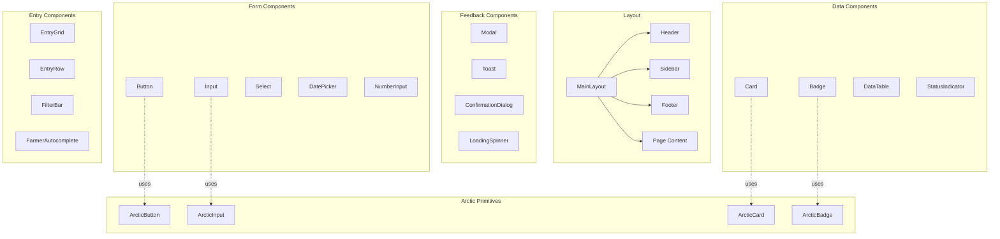
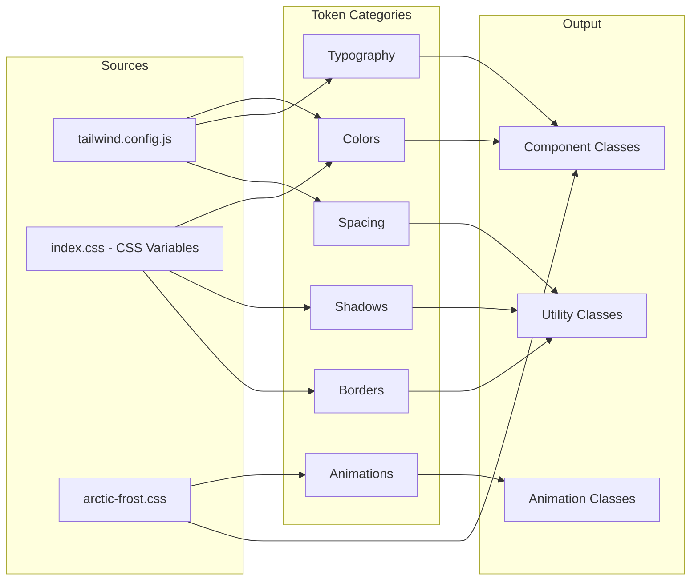
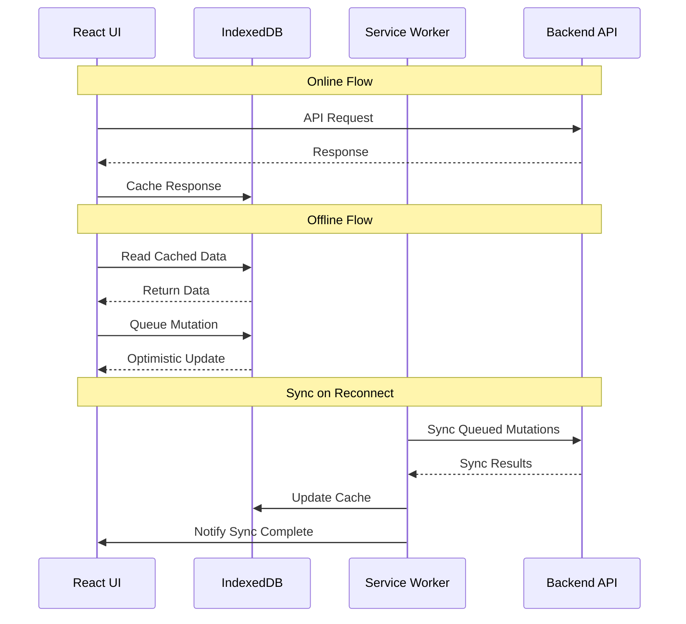
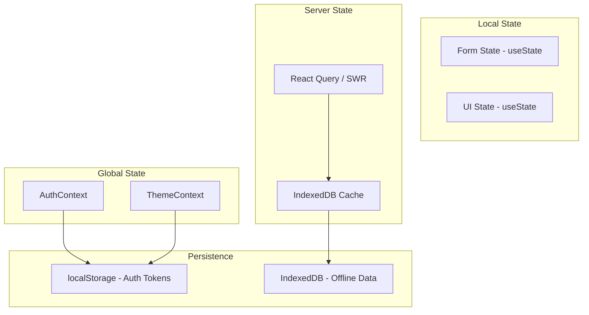
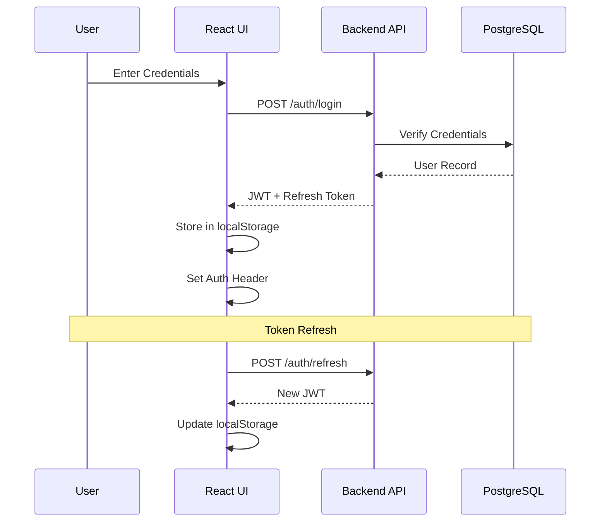
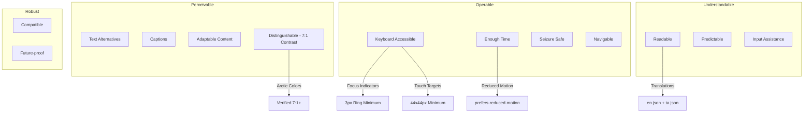
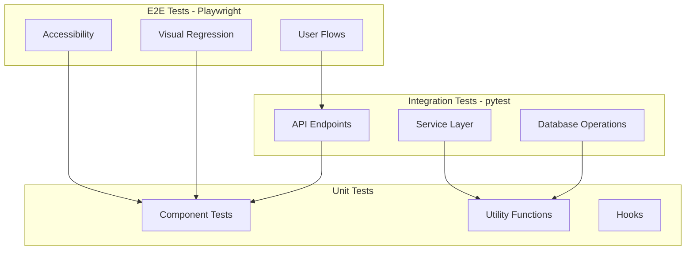
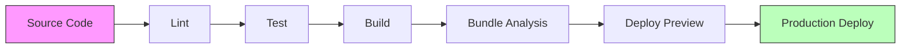

# Architecture Document - UI Redesign (Arctic Frost Completion)

**Branch**: `001-ui-redesign-arctic-frost` | **Date**: 2026-02-17 | **Spec**: [spec.md](./spec.md)
**Input**: Feature specification from `/specs/001-ui-redesign/spec.md`

---

## Summary

Complete the Arctic Frost design system implementation across all 14 pages of the Malar Market Ledger application. The redesign delivers a distinctive, high-contrast UI optimized for early morning market operations (4-9 AM), with full offline-first PWA support, bilingual English/Tamil interface, and WCAG AAA accessibility compliance.

---

## Technical Context

| Aspect | Value |
|--------|-------|
| **Language/Version** | Python 3.11 (Backend), JavaScript ES2022 (Frontend) |
| **Primary Dependencies** | FastAPI, SQLAlchemy 2.0, React 18, Vite, TailwindCSS, i18next |
| **Storage** | PostgreSQL (via Supabase), Redis (caching), IndexedDB (offline) |
| **Testing** | pytest (HTTP-based), Playwright (e2e) |
| **Target Platform** | PWA - Chrome 90+, Firefox 88+, Safari 14+, Edge 90+, Mobile iOS 14+, Android 10+ |
| **Project Type** | Web Application (Frontend + Backend) |
| **Performance Goals** | FCP < 1.5s, LCP < 2.5s, TTI < 3.5s, CLS < 0.1 |
| **Constraints** | Offline-capable during 4-9 AM, < 200ms p95 API response, 44x44px touch targets |
| **Scale/Scope** | 50+ farmers, 14 pages, 20+ components, 100+ daily entries |

---

## Constitution Check

*GATE: Must pass before Phase 0 research. Re-check after Phase 1 design.*

| Principle | Status | Compliance Evidence |
|-----------|--------|---------------------|
| **I. Offline-First Architecture** | ✅ PASS | Service Worker caches all arctic CSS/assets; IndexedDB persistence maintained; UI components functional offline |
| **II. Bilingual Support** | ✅ PASS | All new UI text via `t()` function; Translation keys added to en.json and ta.json; Tamil font (Noto Sans Tamil) included |
| **III. Soft Delete Pattern** | ✅ PASS | API tasks include soft delete filter implementation; No hard delete operations |
| **IV. Type Safety & Async** | ✅ PASS | Backend uses SQLAlchemy 2.0 async; Type aliases from dependencies.py; UUID strings for PKs |
| **V. Test-Driven Development** | ✅ PASS | API tests via requests library; Playwright e2e for UI; Visual regression tests planned |

**Gate Result**: ✅ All constitution checks passed. Proceed with implementation.

---

## Project Structure

### Documentation (this feature)

```text
specs/001-ui-redesign/
├── spec.md              # Feature specification (requirements, user stories)
├── plan.md              # Implementation plan (phases, tasks overview)
├── architecture.md      # This file - technical architecture
├── data-model.md        # Data model changes (if any)
├── contracts/           # API contracts
│   └── api-contracts.md # REST API specifications
└── tasks.md             # Detailed task list
```

### Source Code (repository root)

```text
backend/
├── app/
│   ├── api/
│   │   ├── farmers.py           # UPDATE: Add CRUD endpoints
│   │   ├── daily_entries.py     # UPDATE: Add CRUD endpoints
│   │   ├── settlements.py       # UPDATE: Add CRUD endpoints
│   │   ├── cash_advances.py     # UPDATE: Add CRUD endpoints
│   │   ├── dashboard.py         # NEW: Dashboard activity API
│   │   └── users.py             # UPDATE: Add preferences endpoints
│   ├── models/
│   │   └── user.py              # UPDATE: Add preferences fields
│   └── services/
│       └── audit_service.py     # Existing - for activity feed
├── tests/
│   └── test_api/
│       ├── test_farmers.py      # UPDATE: Add CRUD tests
│       ├── test_daily_entries.py # UPDATE: Add CRUD tests
│       ├── test_settlements.py  # UPDATE: Add CRUD tests
│       ├── test_cash_advances.py # UPDATE: Add CRUD tests
│       └── test_dashboard.py    # NEW: Dashboard API tests

frontend/
├── src/
│   ├── components/
│   │   ├── arctic/              # NEW: Arctic primitive components
│   │   │   ├── ArcticButton.jsx
│   │   │   ├── ArcticInput.jsx
│   │   │   ├── ArcticCard.jsx
│   │   │   └── ArcticBadge.jsx
│   │   ├── layout/              # UPDATE: Arctic styling
│   │   ├── forms/               # UPDATE: Arctic styling
│   │   ├── feedback/            # UPDATE: Arctic styling
│   │   ├── data/                # UPDATE: Arctic styling
│   │   ├── entry/               # PARTIAL: Complete arctic migration
│   │   └── settlement/          # PARTIAL: Complete arctic migration
│   ├── pages/
│   │   ├── LoginPage.jsx        # UPDATE: Arctic redesign
│   │   ├── DashboardPage.jsx    # UPDATE: Arctic redesign
│   │   ├── DailyEntryPage.jsx   # UPDATE: Complete arctic
│   │   ├── SettlementsPage.jsx  # UPDATE: Complete arctic
│   │   ├── FarmersPage.jsx      # UPDATE: Arctic redesign
│   │   ├── MarketRatesPage.jsx  # UPDATE: Arctic redesign
│   │   ├── ReportsPage.jsx      # UPDATE: Arctic redesign
│   │   ├── CashAdvancesPage.jsx # UPDATE: Arctic redesign
│   │   ├── InvoicePage.jsx      # UPDATE: Arctic redesign
│   │   ├── SettingsPage.jsx     # UPDATE: Arctic redesign
│   │   ├── BusinessSettingsPage.jsx # UPDATE: Arctic redesign
│   │   ├── ForgotPasswordPage.jsx   # UPDATE: Arctic redesign
│   │   └── ResetPasswordPage.jsx    # UPDATE: Arctic redesign
│   ├── services/
│   │   ├── farmerService.js     # VERIFY: Works with updated API
│   │   ├── dailyEntryService.js # VERIFY: Works with updated API
│   │   ├── settlementService.js # VERIFY: Works with updated API
│   │   ├── cashAdvanceService.js # VERIFY: Works with updated API
│   │   ├── dashboardService.js  # NEW: Dashboard API calls
│   │   └── preferencesService.js # NEW: User preferences API
│   ├── styles/
│   │   ├── arctic-frost.css     # UPDATE: Enhanced with variables
│   │   ├── arctic.css           # LEGACY: To be removed
│   │   └── animations.css       # NEW: Animation keyframes
│   ├── context/
│   │   └── ThemeContext.jsx     # UPDATE: Enhanced with toggle
│   └── i18n/
│       ├── en.json              # UPDATE: New translation keys
│       └── ta.json              # UPDATE: Tamil translations
├── public/
│   ├── sw.js                    # UPDATE: Cache new CSS/fonts
│   └── manifest.json            # UPDATE: Theme colors
└── tests/
    └── e2e/                     # Playwright tests
        ├── login.spec.js
        ├── dashboard.spec.js
        └── daily-entry.spec.js
```

**Structure Decision**: Web application with separate frontend/backend. Frontend uses React component architecture with arctic/ directory for new primitive components. Backend follows FastAPI router pattern.

---

## Component Architecture

### Component Hierarchy



### Design Token System



---

## API Architecture

### RESTful Endpoint Structure

```mermaid
flowchart TD
    subgraph API Gateway
        A[/api/v1/*]
    end
    
    subgraph Core Resources
        B[/farmers]
        C[/daily-entries]
        D[/settlements]
        E[/cash-advances]
    end
    
    subgraph New Endpoints
        F[/dashboard]
        G[/users/me/preferences]
    end
    
    subgraph Operations
        H[GET / - List with pagination]
        I[GET /{id} - Single resource]
        J[POST / - Create]
        K[PUT /{id} - Update]
        L[DELETE /{id} - Soft delete]
    end
    
    A --> B
    A --> C
    A --> D
    A --> E
    A --> F
    A --> G
    
    B --> H
    B --> I
    B --> J
    B --> K
    B --> L
```

### Standard Response Envelope

```json
{
  "success": true,
  "data": [...],
  "pagination": {
    "page": 1,
    "page_size": 20,
    "total_items": 150,
    "total_pages": 8,
    "has_next": true,
    "has_previous": false
  }
}
```

### Error Response Format

```json
{
  "success": false,
  "error": {
    "code": "VALIDATION_ERROR",
    "message": "Invalid input data",
    "details": [
      {"field": "name", "message": "Name is required"}
    ]
  }
}
```

---

## Data Flow Architecture

### Offline-First Data Flow



### State Management Flow



---

## Security Architecture

### Authentication Flow



### Authorization Matrix

| Role | Farmers | Daily Entries | Settlements | Cash Advances | Users | Settings |
|------|---------|---------------|-------------|---------------|-------|----------|
| Admin | CRUD | CRUD | CRUD + Approve | CRUD + Approve | CRUD | All |
| Staff | Read | CRUD | Read + Create | Read + Create | Read | Limited |
| Farmer | Read Self | Read Own | Read Own | Read Own | - | - |

---

## Performance Architecture

### Critical Rendering Path

```mermaid
flowchart LR
    A[HTML] --> B[Critical CSS]
    B --> C[First Contentful Paint]
    C --> D[Fonts Load]
    D --> E[Largest Contentful Paint]
    E --> F[JavaScript Hydrate]
    F --> G[Time to Interactive]
    
    style A fill:#f9f,stroke:#333
    style B fill:#bbf,stroke:#333
    style C fill:#bfb,stroke:#333
    style D fill:#bbf,stroke:#333
    style E fill:#bfb,stroke:#333
    style F fill:#bbf,stroke:#333
    style G fill:#bfb,stroke:#333
```



### Optimization Strategies

| Strategy | Implementation | Target |
|----------|----------------|--------|
| Font Loading | font-display: swap, preconnect | < 100ms font swap |
| CSS Delivery | Critical CSS inline, async load rest | < 1.5s FCP |
| Image Optimization | WebP format, lazy loading | < 100KB per image |
| Code Splitting | Route-based chunks | < 200KB initial JS |
| Caching | Service Worker, IndexedDB | Instant repeat visits |

---

## Accessibility Architecture

### WCAG AAA Compliance Map



### Focus Management

| Component | Focus Behavior |
|-----------|----------------|
| Modal | Focus trap, return focus on close |
| Toast | Announce via aria-live, no focus |
| Dropdown | Arrow keys navigate, Enter select |
| DataTable | Tab to row, Arrow keys within |
| Form | Tab order follows visual order |

---

## Testing Architecture

### Test Pyramid



### Test Coverage Requirements

| Category | Tool | Minimum Coverage |
|----------|------|------------------|
| Backend API | pytest + requests | 80% |
| Frontend Components | Playwright | All pages |
| Visual Regression | Playwright screenshots | All components |
| Accessibility | axe-core | All pages |
| E2E User Flows | Playwright | Critical paths |

---

## Deployment Architecture

### Build Pipeline



### Environment Configuration

| Environment | Frontend | Backend |
|-------------|----------|---------|
| Development | localhost:5173 | localhost:8000 |
| Staging | staging.malarledger.com | staging-api.malarledger.com |
| Production | malarledger.com | api.malarledger.com |

---

## Risk Mitigation

| Risk | Probability | Impact | Mitigation |
|------|-------------|--------|------------|
| Breaking existing UI | Medium | High | Incremental migration, visual regression tests |
| Performance regression | Low | High | Lighthouse CI, bundle size monitoring |
| Accessibility issues | Low | Medium | axe-core integration, manual testing |
| Tamil font rendering | Low | Medium | Early testing, fallback fonts |
| Offline sync conflicts | Low | Medium | Last-write-wins with timestamps |

---

## Success Criteria

- [ ] All 14 pages use Arctic Frost styling
- [ ] WCAG AAA accessibility compliance verified
- [ ] Lighthouse performance score > 90
- [ ] No warm-color palette remnants in production
- [ ] All micro-interactions implemented
- [ ] Mobile responsive on all pages
- [ ] Tamil rendering verified
- [ ] Offline functionality preserved
- [ ] All API endpoints standardized
- [ ] Test coverage > 80%

---

## Appendix A: File Change Summary

### New Files to Create

| File | Purpose |
|------|---------|
| `frontend/src/components/arctic/ArcticButton.jsx` | Arctic button primitive |
| `frontend/src/components/arctic/ArcticInput.jsx` | Arctic input primitive |
| `frontend/src/components/arctic/ArcticCard.jsx` | Arctic card primitive |
| `frontend/src/components/arctic/ArcticBadge.jsx` | Arctic badge primitive |
| `frontend/src/styles/animations.css` | Animation keyframes |
| `frontend/src/services/dashboardService.js` | Dashboard API client |
| `frontend/src/services/preferencesService.js` | Preferences API client |
| `backend/app/api/dashboard.py` | Dashboard API endpoints |
| `backend/tests/test_api/test_dashboard.py` | Dashboard API tests |

### Files to Update

| File | Changes |
|------|---------|
| `frontend/tailwind.config.js` | Add arctic color tokens |
| `frontend/src/index.css` | Add CSS custom properties |
| `frontend/src/styles/arctic-frost.css` | Enhance with variables |
| All page components (14 files) | Apply arctic styling |
| All form components (5 files) | Apply arctic styling |
| All feedback components (4 files) | Apply arctic styling |
| All data components (4 files) | Apply arctic styling |
| `backend/app/api/farmers.py` | Add CRUD endpoints |
| `backend/app/api/daily_entries.py` | Add CRUD endpoints |
| `backend/app/api/settlements.py` | Add CRUD endpoints |
| `backend/app/api/cash_advances.py` | Add CRUD endpoints |
| `backend/app/api/users.py` | Add preferences endpoints |
| `frontend/src/i18n/en.json` | New translation keys |
| `frontend/src/i18n/ta.json` | Tamil translations |

### Files to Remove

| File | Reason |
|------|--------|
| `frontend/src/styles/arctic.css` | Replaced by arctic-frost.css |

---

## Appendix B: Glossary

| Term | Definition |
|------|------------|
| Arctic Frost | The new design system with high-contrast, cool color palette |
| Flash Freeze | Animation effect when a row is saved (blue glow) |
| Glacier Blue | Primary interactive color (#3B82F6) |
| Aurora Green | Success status color (#10B981) |
| Frostbite Red | Error status color (#EF4444) |
| Gold Ice | Warning status color (#F59E0B) |
| Soft Delete | Setting deleted_at timestamp instead of physical deletion |
| PWA | Progressive Web App - works offline |
| WCAG AAA | Highest accessibility compliance level (7:1 contrast) |
