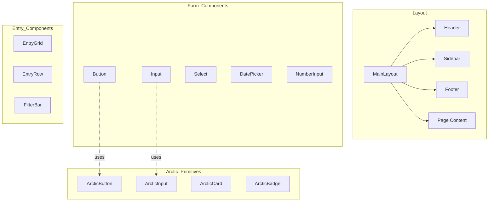

# Implementation Plan: UI Redesign - Arctic Frost Completion

**Branch**: `001-ui-redesign-arctic-frost` | **Date**: 2026-02-17 | **Spec**: [spec.md](./spec.md)
**Input**: Feature specification from `/specs/001-ui-redesign/spec.md`

---

## Summary

Complete the Arctic Frost design system implementation across all 14 pages of the Malar Market Ledger application. The redesign delivers a distinctive, high-contrast UI optimized for early morning market operations (4-9 AM), with full offline-first PWA support, bilingual English/Tamil interface, and WCAG AAA accessibility compliance. Includes backend API completion to support enhanced dashboard and user preference features.

---

## Technical Context

**Language/Version**: Python 3.11 (Backend), JavaScript ES2022 (Frontend)
**Primary Dependencies**: FastAPI, SQLAlchemy 2.0 async, React 18, Vite, TailwindCSS, i18next, Framer Motion
**Storage**: PostgreSQL (via Supabase), Redis (caching), IndexedDB (offline persistence)
**Testing**: pytest (HTTP-based requests), Playwright (e2e)
**Target Platform**: PWA - Chrome 90+, Firefox 88+, Safari 14+, Edge 90+, Mobile iOS 14+, Android 10+
**Project Type**: Web Application (Frontend + Backend)
**Performance Goals**: FCP < 1.5s, LCP < 2.5s, TTI < 3.5s, CLS < 0.1
**Constraints**: Offline-capable during 4-9 AM, < 200ms p95 API response, 44x44px touch targets
**Scale/Scope**: 50+ farmers, 14 pages, 20+ components, 100+ daily entries

---

## Constitution Check

*GATE: Must pass before Phase 0 research. Re-check after Phase 1 design.*

| Principle | Status | Evidence |
|-----------|--------|----------|
| **I. Offline-First Architecture** | ✅ PASS | Service Worker caches all arctic CSS/assets; IndexedDB persistence maintained; UI components functional offline |
| **II. Bilingual Support** | ✅ PASS | All new UI text via `t()` function; Translation keys added to en.json and ta.json; Tamil font (Noto Sans Tamil) included |
| **III. Soft Delete Pattern** | ✅ PASS | API tasks include soft delete filter implementation; No hard delete operations |
| **IV. Type Safety & Async** | ✅ PASS | Backend uses SQLAlchemy 2.0 async; Type aliases from dependencies.py; UUID strings for PKs |
| **V. Test-Driven Development** | ✅ PASS | API tests via requests library; Playwright e2e for UI; Visual regression tests planned |

**Gate Result**: ✅ All constitution checks passed. Proceed with implementation.

---

## Project Structure

### Documentation (this feature)

```text
specs/001-ui-redesign/
├── spec.md              # Feature specification (requirements, user stories)
├── plan.md              # This file - implementation plan
├── architecture.md      # Technical architecture details
├── contracts/
│   └── api-contracts.md # REST API specifications
└── tasks.md             # Detailed task list (90 tasks)
```

### Source Code (repository root)

```text
backend/
├── app/
│   ├── api/
│   │   ├── farmers.py           # UPDATE: Add CRUD endpoints
│   │   ├── daily_entries.py     # UPDATE: Add CRUD endpoints
│   │   ├── settlements.py       # UPDATE: Add CRUD endpoints
│   │   ├── cash_advances.py     # UPDATE: Add CRUD endpoints
│   │   ├── dashboard.py         # NEW: Dashboard activity API
│   │   └── users.py             # UPDATE: Add preferences endpoints
│   ├── models/
│   │   └── user.py              # UPDATE: Add preferences fields
│   └── services/
│       └── audit_service.py     # Existing - for activity feed
├── tests/
│   └── test_api/
│       ├── test_farmers.py      # UPDATE: Add CRUD tests
│       ├── test_daily_entries.py # UPDATE: Add CRUD tests
│       ├── test_settlements.py  # UPDATE: Add CRUD tests
│       ├── test_cash_advances.py # UPDATE: Add CRUD tests
│       └── test_dashboard.py    # NEW: Dashboard API tests

frontend/
├── src/
│   ├── components/
│   │   ├── arctic/              # NEW: Arctic primitive components
│   │   │   ├── ArcticButton.jsx
│   │   │   ├── ArcticInput.jsx
│   │   │   ├── ArcticCard.jsx
│   │   │   └── ArcticBadge.jsx
│   │   ├── layout/              # UPDATE: Arctic styling
│   │   ├── forms/               # UPDATE: Arctic styling
│   │   ├── feedback/            # UPDATE: Arctic styling
│   │   ├── data/                # UPDATE: Arctic styling
│   │   ├── entry/               # PARTIAL: Complete arctic migration
│   │   └── settlement/          # PARTIAL: Complete arctic migration
│   ├── pages/
│   │   └── [14 pages]           # UPDATE: Arctic redesign per phase
│   ├── services/
│   │   ├── farmerService.js     # VERIFY: Works with updated API
│   │   ├── dailyEntryService.js # VERIFY: Works with updated API
│   │   ├── dashboardService.js  # NEW: Dashboard API calls
│   │   └── preferencesService.js # NEW: Preferences API calls
│   ├── styles/
│   │   ├── arctic-frost.css     # UPDATE: Enhanced with variables
│   │   ├── arctic.css           # LEGACY: To be removed
│   │   └── animations.css       # NEW: Animation keyframes
│   ├── context/
│   │   └── ThemeContext.jsx     # UPDATE: Enhanced with toggle
│   └── i18n/
│       ├── en.json              # UPDATE: New translation keys
│       └── ta.json              # UPDATE: Tamil translations
├── public/
│   └── sw.js                    # UPDATE: Cache new CSS/fonts
└── tests/
    └── e2e/                     # Playwright tests
```

**Structure Decision**: Web application with separate frontend/backend. Frontend uses React component architecture with arctic/ directory for new primitive components. Backend follows FastAPI router pattern.

---

## Architecture Overview

### Design Direction

**Theme**: Arctic Frost - A crisp, high-contrast design system optimized for early morning market operations.

**Aesthetic Philosophy**: Intentional Minimalism with Glacial Precision
- Anti-generic: Reject template-like layouts
- Distinctive: Bespoke typography and spatial composition
- Purposeful: Every element earns its place
- Refined: Precision in spacing, typography, and subtle details

### Technology Stack

| Layer | Technology | Notes |
|-------|------------|-------|
| Framework | React 18 + Vite | Existing |
| Styling | Tailwind CSS + Custom CSS | Extended with arctic tokens |
| Animation | CSS + Framer Motion | For complex interactions |
| Icons | Lucide React | Consistent icon set |
| Fonts | Google Fonts | Distinctive + Tamil support |
| i18n | react-i18next | Existing |

### Component Architecture



---

## Phase 1: Foundation

### 1.1 Design Tokens & Variables
**Objective**: Establish the complete Arctic Frost token system

**Files to modify**:
- `frontend/tailwind.config.js` - Add arctic color tokens
- `frontend/src/index.css` - Add CSS custom properties
- `frontend/src/styles/arctic-frost.css` - Enhance existing

**Token Categories**:
1. Colors (backgrounds, text, status, interactive)
2. Typography (fonts, sizes, weights, line-heights)
3. Spacing (compact, standard, generous)
4. Shadows (frost-sm, frost-md, frost-lg, frost-focus)
5. Borders (radius, widths, colors)
6. Animations (durations, easings, keyframes)

### 1.2 Typography System
**Objective**: Implement distinctive typography

**Font Selection**:
| Role | Font | Rationale |
|------|------|-----------|
| Display | Outfit | Modern geometric, distinctive |
| Body | DM Sans | Refined, excellent readability |
| Mono | JetBrains Mono | Financial numbers, code |
| Tamil | Noto Sans Tamil | Excellent Tamil rendering |

**Implementation**:
- Add Google Fonts links to `index.html`
- Configure font families in Tailwind
- Create typography utility classes

### 1.3 Base Component Primitives
**Objective**: Create arctic-styled base components

**Components**:
- Button (primary, secondary, ghost, danger)
- Input (text, number, search)
- Select (single, multi)
- Card (basic, elevated, interactive)
- Badge (status, count, tag)

---

## Phase 2: Core Components

### 2.1 Layout Components
**Files to update**:
- `frontend/src/components/layout/Header.jsx`
- `frontend/src/components/layout/Sidebar.jsx`
- `frontend/src/components/layout/Footer.jsx`
- `frontend/src/components/layout/MainLayout.jsx`

**Changes**:
- Apply arctic background colors
- Add frosted glass effect (backdrop-filter)
- Implement smooth transitions
- Add active state indicators

### 2.2 Form Components
**Files to update**:
- `frontend/src/components/forms/Button.jsx`
- `frontend/src/components/forms/Input.jsx`
- `frontend/src/components/forms/Select.jsx`
- `frontend/src/components/forms/DatePicker.jsx`
- `frontend/src/components/forms/NumberInput.jsx`

**Changes**:
- Arctic input styling (border, focus ring)
- Floating labels animation
- Validation state indicators
- Touch-friendly sizing

### 2.3 Feedback Components
**Files to update**:
- `frontend/src/components/feedback/Modal.jsx`
- `frontend/src/components/feedback/Toast.jsx`
- `frontend/src/components/feedback/ConfirmationDialog.jsx`
- `frontend/src/components/feedback/LoadingSpinner.jsx`

**Changes**:
- Frosted glass modal backdrop
- Toast animations (slide in/out)
- Arctic spinner design
- Confirmation dialog styling

### 2.4 Data Components
**Files to update**:
- `frontend/src/components/data/Card.jsx`
- `frontend/src/components/data/Badge.jsx`
- `frontend/src/components/data/StatusIndicator.jsx`
- `frontend/src/components/data/DataTable.jsx`

**Changes**:
- Card hover effects
- Badge color variants (arctic status colors)
- Status indicator glow effects
- Table styling consistency

---

## Phase 3: Page Redesigns

### 3.1 Authentication Pages (P0)
**Pages**:
- `frontend/src/pages/LoginPage.jsx`
- `frontend/src/pages/ForgotPasswordPage.jsx`
- `frontend/src/pages/ResetPasswordPage.jsx`

**Design Direction**:
- Asymmetric split layout
- Gradient mesh background
- Floating form card with glass effect
- Smooth entrance animations
- Language toggle prominent

### 3.2 Dashboard Page (P0)
**Page**: `frontend/src/pages/DashboardPage.jsx`

**Design Direction**:
- Stat cards with arctic styling
- Quick action buttons with gradients
- Recent activity timeline
- Today's summary hero section
- Chart integration with arctic colors

### 3.3 Daily Entry Page (P0)
**Page**: `frontend/src/pages/DailyEntryPage.jsx`

**Status**: Partially complete (Arctic version exists)

**Remaining work**:
- Filter bar enhancement
- Mobile responsive card view
- Entrance animations
- Keyboard navigation polish

### 3.4 Settlements Page (P0)
**Page**: `frontend/src/pages/SettlementsPage.jsx`

**Status**: Partially complete (Arctic version exists)

**Remaining work**:
- Status badge animations
- Action button styling
- Summary cards enhancement
- Print stylesheet

### 3.5 Farmers Page (P1)
**Page**: `frontend/src/pages/FarmersPage.jsx`

**Changes**:
- DataTable arctic styling
- Farmer card redesign
- Add/Edit modal arctic styling
- Search input enhancement

### 3.6 Market Rates Page (P1)
**Page**: `frontend/src/pages/MarketRatesPage.jsx`

**Changes**:
- Time slot cards arctic styling
- Rate input styling
- Save animation feedback
- Historical rates table

### 3.7 Reports Page (P1)
**Page**: `frontend/src/pages/ReportsPage.jsx`

**Changes**:
- Report type cards
- Date range picker styling
- Generate button animation
- Preview modal styling

### 3.8 Cash Advances Page (P1)
**Page**: `frontend/src/pages/CashAdvancesPage.jsx`

**Changes**:
- Advances table arctic styling
- Add advance modal
- Balance indicator
- Repayment tracking UI

### 3.9 Invoice Page (P1)
**Page**: `frontend/src/pages/InvoicePage.jsx`

**Changes**:
- Invoice preview arctic styling
- Print optimization
- Action buttons
- Status indicators

### 3.10 Settings Pages (P2)
**Pages**:
- `frontend/src/pages/SettingsPage.jsx`
- `frontend/src/pages/BusinessSettingsPage.jsx`

**Changes**:
- Settings sections styling
- Toggle switches arctic design
- Form layout improvements
- Save confirmation feedback

---

## Phase 3.5: Backend API Completion

> **Note**: API audit revealed significant gaps. This phase ensures backend supports all UI features.

### 3.5.1 Core CRUD Operations (P0)
**Objective**: Implement missing CRUD endpoints for core modules.

**Files to modify**:
- `backend/app/api/farmers.py` - Add POST, PUT, DELETE, balance, search
- `backend/app/api/daily_entries.py` - Add GET /{id}, POST, PUT, DELETE, summary, bulk
- `backend/app/api/settlements.py` - Add GET /{id}, generate, approve, pay
- `backend/app/api/cash_advances.py` - Add POST, approve, reject

**Implementation Pattern**:
```python
@router.post("/", response_model=FarmerResponse)
async def create_farmer(
    data: FarmerCreate,
    db: DatabaseSession,
    current_user: CurrentAdminUser
) -> FarmerResponse:
    """Create new farmer with validation."""
    # Check for duplicates
    # Create farmer with UUID string ID
    # Apply soft delete filter on queries
    # Return standard envelope format
```

### 3.5.2 Response Format Standardization (P0)
**Objective**: Standardize all API responses to match documented format.

**Current Issues**:
- `farmers.py` returns `{"farmers": [...]}` instead of `{"success": true, "data": [...]}`
- `daily_entries.py` returns `{"entries": [...]}` without pagination
- `settlements.py` returns `{"settlements": [...]}` without metadata
- `cash_advances.py` returns `{"advances": [...]}` inconsistent format

**Target Format**:
```json
{
  "success": true,
  "data": [...],
  "pagination": {
    "page": 1,
    "page_size": 20,
    "total_items": 150,
    "total_pages": 8,
    "has_next": true,
    "has_previous": false
  }
}
```

### 3.5.3 Soft Delete Implementation (P0)
**Objective**: Add soft delete filters to all list queries.

**Files to modify**:
| File | Current | Required Change |
|------|---------|-----------------|
| `daily_entries.py` | Missing | Add `DailyEntry.deleted_at == None` |
| `settlements.py` | Missing | Add `Settlement.deleted_at == None` |
| `cash_advances.py` | Missing | Add `CashAdvance.deleted_at == None` |

### 3.5.4 Dashboard API Module (P1)
**Objective**: Create new dashboard endpoints for enhanced UI.

**New file**: `backend/app/api/dashboard.py`

**Endpoints**:
```
GET /api/v1/dashboard/activity     - Recent activity feed
GET /api/v1/dashboard/quick-stats  - Aggregated statistics
```

### 3.5.5 User Preferences API (P1)
**Objective**: Create endpoints for theme and preference management.

**Files to modify**:
- `backend/app/api/users.py` - Add preferences endpoints
- `backend/app/models/user.py` - Add preferences fields (if needed)

**Endpoints**:
```
GET /api/v1/users/me/preferences   - Get user preferences
PUT /api/v1/users/me/preferences   - Update preferences
```

### 3.5.6 Frontend Service Updates (P1)
**Objective**: Update frontend services to match completed APIs.

**Files to modify**:
- `frontend/src/services/farmerService.js` - Ensure CRUD methods work
- `frontend/src/services/dailyEntryService.js` - Ensure CRUD methods work
- `frontend/src/services/settlementService.js` - Ensure CRUD methods work
- `frontend/src/services/cashAdvanceService.js` - Ensure CRUD methods work
- `frontend/src/services/dashboardService.js` - NEW - Dashboard API calls
- `frontend/src/services/preferencesService.js` - NEW - Preferences API calls

### 3.5.7 API Testing (P0)
**Objective**: Add tests for all new/updated endpoints.

**Test files to create/update**:
- `backend/tests/test_api/test_farmers.py` - Add CRUD tests
- `backend/tests/test_api/test_daily_entries.py` - Add CRUD tests
- `backend/tests/test_api/test_settlements.py` - Add CRUD tests
- `backend/tests/test_api/test_cash_advances.py` - Add CRUD tests
- `backend/tests/test_api/test_dashboard.py` - NEW - Dashboard tests

---

## Phase 4: Polish & Optimization

### 4.1 Micro-interactions
**Scope**: All interactive elements

**Animations**:
- Page load staggered reveals
- Row save flash freeze
- Focus ring pulse
- Button press scale
- Tag toggle smooth
- Modal fade/slide
- Toast slide in/out

### 4.2 Responsive Refinement
**Breakpoints**:
- Mobile: < 640px
- Tablet: 640-1024px
- Desktop: > 1024px

**Deliverables**:
- Mobile card views for all tables
- Horizontal scroll with sticky columns
- Touch target verification
- Orientation change handling

### 4.3 Accessibility Audit
**Requirements**:
- WCAG AAA contrast verification
- Keyboard navigation testing
- Screen reader testing
- Reduced motion support
- Focus indicator visibility

### 4.4 Performance Optimization
**Targets**:
- Font loading optimization (font-display: swap)
- CSS minification
- Animation performance (transform/opacity only)
- Image optimization
- Service Worker cache update

---

## Migration Strategy

### Approach: Incremental Migration
1. **Parallel existence**: New arctic components alongside old
2. **Feature flags**: Use theme context to switch
3. **Page-by-page**: Migrate one page at a time
4. **Testing**: Visual regression testing per page

### Rollback Plan
- Keep old CSS classes until full migration
- Theme toggle for quick rollback
- Git branches per phase

---

## Testing Strategy

### Visual Regression
- Playwright screenshots per page
- Compare before/after migration
- Mobile and desktop views

### Accessibility Testing
- axe-core integration
- Keyboard navigation tests
- Screen reader testing (NVDA, VoiceOver)

### Performance Testing
- Lighthouse audits
- Web Vitals monitoring
- Animation frame rate testing

---

## Risk Mitigation

| Risk | Probability | Impact | Mitigation |
|------|-------------|--------|------------|
| Breaking existing functionality | Medium | High | Incremental migration, thorough testing |
| Performance degradation | Low | High | Animation performance audit, lazy loading |
| Accessibility regression | Low | Medium | Automated + manual accessibility testing |
| User confusion | Low | Medium | Gradual rollout, user training |
| Tamil font issues | Low | Medium | Early font testing, fallback fonts |
| Offline sync conflicts | Low | Medium | Last-write-wins with timestamps |

---

## Success Criteria

- [ ] All 14 pages use Arctic Frost styling
- [ ] WCAG AAA accessibility compliance
- [ ] Lighthouse performance score > 90
- [ ] No warm-color palette remnants
- [ ] All micro-interactions implemented
- [ ] Mobile responsive on all pages
- [ ] Tamil rendering verified
- [ ] Offline functionality preserved
- [ ] All API endpoints standardized
- [ ] Test coverage > 80%

---

## Complexity Tracking

> No constitution violations. All principles satisfied.

| Violation | Why Needed | Simpler Alternative Rejected Because |
|-----------|------------|-------------------------------------|
| N/A | N/A | N/A |

---

## Related Documents

- [Specification](./spec.md) - Requirements and user stories
- [Architecture](./architecture.md) - Detailed technical architecture
- [API Contracts](./contracts/api-contracts.md) - REST API specifications
- [Tasks](./tasks.md) - Detailed implementation tasks (90 total)
