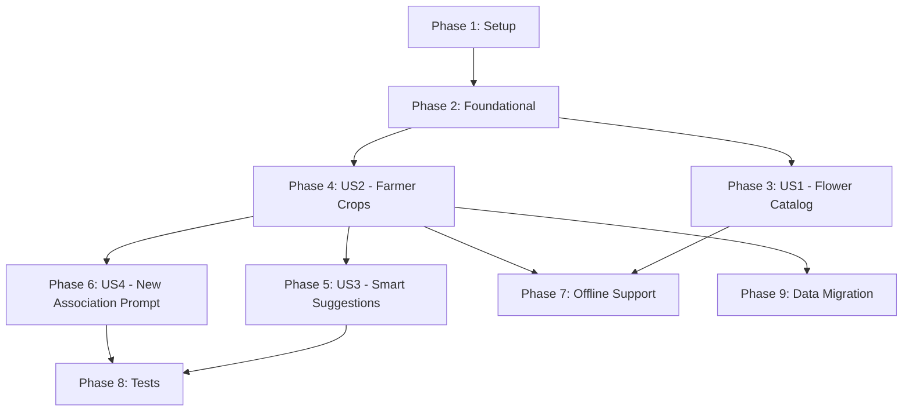

# Tasks: Shop-Specific Flower Types and Farmer Mapping

**Input**: Design documents from `/specs/002-flower-farmer-mapping/`
**Prerequisites**: plan.md (required), spec.md (required), data-model.md, quickstart.md

## Format: `[ID] [P?] [Story] Description`

- **[P]**: Can run in parallel (different files, no dependencies)
- **[Story]**: Which user story this task belongs to (US1, US2, US3, US4)
- Paths assume web app structure: `backend/`, `frontend/`

---

## Phase 1: Setup (Shared Infrastructure)

**Purpose**: Database schema and base models

- [ ] T001 [P] Add `deleted_at` field to FlowerType model in `backend/app/models/flower_type.py`
- [ ] T002 [P] Add `farmer_products` relationship to FlowerType model
- [ ] T003 Create FarmerProduct model in `backend/app/models/farmer_product.py`
- [ ] T004 Add `farmer_products` relationship to Farmer model in `backend/app/models/farmer.py`
- [ ] T005 Register FarmerProduct in `backend/app/models/__init__.py`
- [ ] T006 Generate Alembic migration: `alembic revision --autogenerate -m "add_farmer_products_table"`
- [ ] T007 Apply migration: `alembic upgrade head`

**Checkpoint**: Database schema ready with farmer_products table

---

## Phase 2: Foundational (Blocking Prerequisites)

**Purpose**: Core API infrastructure that MUST be complete before user stories

**⚠️ CRITICAL**: No user story work can begin until this phase is complete

- [ ] T008 [P] Create FarmerProductBase schema in `backend/app/schemas/all_schemas.py`
- [ ] T009 [P] Create FarmerProductCreate schema
- [ ] T010 [P] Create FarmerProductResponse schema
- [ ] T011 [P] Create SuggestedFlowerResponse schema
- [ ] T012 Create `backend/app/api/farmer_products.py` router file
- [ ] T013 Register farmer_products router in `backend/app/api/routes.py`

**Checkpoint**: API infrastructure ready - user story implementation can begin

---

## Phase 3: User Story 1 - Configure Shop Flower Catalog (Priority: P1) 🎯 MVP

**Goal**: Allow admins to activate/deactivate flower types so staff only see relevant flowers

**Independent Test**: Access Flower Management screen, toggle flower active status, verify dropdowns reflect changes

### Implementation for User Story 1

- [ ] T014 [US1] Verify `PATCH /flower-types/{id}/activate` endpoint works in `backend/app/api/flower_types.py`
- [ ] T015 [US1] Verify `PATCH /flower-types/{id}/deactivate` endpoint works
- [ ] T016 [US1] Add validation to prevent deactivating last active flower
- [ ] T017 [US1] Ensure all flower queries filter by `deleted_at == None` and `is_active == True`
- [ ] T018 [US1] Verify `GET /flower-types/active` returns only active flowers

**Checkpoint**: Admins can manage flower catalog, inactive flowers hidden from dropdowns

---

## Phase 4: User Story 2 - Link Farmers to Their Crops (Priority: P1) 🎯 MVP

**Goal**: Associate farmers with flower types they supply for smart suggestions

**Independent Test**: Edit farmer profile, select crops via checkboxes, verify associations saved

### Implementation for User Story 2

- [ ] T019 [US2] Implement `GET /farmers/{farmer_id}/products` in `backend/app/api/farmer_products.py`
- [ ] T020 [US2] Implement `POST /farmers/{farmer_id}/products` with duplicate prevention
- [ ] T021 [US2] Implement `DELETE /farmers/{farmer_id}/products/{flower_id}`
- [ ] T022 [US2] Create `frontend/src/services/farmerProductService.js` with API functions
- [ ] T023 [US2] Create `frontend/src/components/farmers/FarmerCropSelector.jsx` component
- [ ] T024 [US2] Add FarmerCropSelector to farmer create/edit form
- [ ] T025 [US2] Add translation keys to `frontend/src/i18n/en.json` and `ta.json`

**Checkpoint**: Farmers can be associated with multiple flower types via checkbox UI

---

## Phase 5: User Story 3 - Smart Flower Suggestion During Entry (Priority: P2)

**Goal**: Auto-select or prioritize flowers based on farmer's associations

**Independent Test**: Select farmer in daily entry, verify flower auto-selected or prioritized

### Implementation for User Story 3

- [ ] T026 [US3] Implement `GET /farmers/{farmer_id}/suggested-flower` endpoint
- [ ] T027 [US3] Add auto-select logic for single-crop farmers
- [ ] T028 [US3] Add prioritize logic for multi-crop farmers
- [ ] T029 [US3] Import getSuggestedFlower in `frontend/src/components/entry/EntryGridArctic.jsx`
- [ ] T030 [US3] Add useEffect to fetch suggestion on farmer selection
- [ ] T031 [US3] Implement auto-selection for suggestion_type === auto_select
- [ ] T032 [US3] Implement dropdown sorting for suggestion_type === prioritize
- [ ] T033 [US3] Highlight associated flowers in dropdown

**Checkpoint**: Daily entry faster with smart flower suggestions

---

## Phase 6: User Story 4 - Prompt to Add New Crop Association (Priority: P3)

**Goal**: Prompt staff to add new flower to farmer's profile when they bring different flower

**Independent Test**: Select farmer, choose non-associated flower, verify prompt appears

### Implementation for User Story 4

- [ ] T034 [US4] Create toast/prompt component for new association suggestion
- [ ] T035 [US4] Detect when selected flower not in farmer's associations
- [ ] T036 [US4] Show prompt after entry save with new flower
- [ ] T037 [US4] Add Yes/No buttons with immediate API call on Yes
- [ ] T038 [US4] Add translation keys for prompt text

**Checkpoint**: System learns farmer preferences over time

---

## Phase 7: Offline Support (Cross-Cutting)

**Purpose**: Enable feature to work without network during 4-9 AM rush hours

- [ ] T039 [P] Add `FARMER_PRODUCTS_CACHE` store to `frontend/src/store/offlineStore.js`
- [ ] T040 [P] Increment DB_VERSION to trigger IndexedDB upgrade
- [ ] T041 Implement `cacheFarmerProducts(farmerId, products)` function
- [ ] T042 Implement `getCachedFarmerProducts(farmerId)` function
- [ ] T043 Cache farmer products on app load
- [ ] T044 Use cached data when offline
- [ ] T045 Queue new associations in SYNC_QUEUE when offline
- [ ] T046 Process queued associations when back online

**Dependencies**: Phases 3-4 complete

---

## Phase 8: Tests (Optional)

**Purpose**: Verify feature works correctly

### Backend Tests

- [ ] T047 [P] Create `backend/tests/test_api/test_farmer_products.py`
- [ ] T048 [P] Test GET /farmers/{id}/products
- [ ] T049 [P] Test POST /farmers/{id}/products with duplicate prevention
- [ ] T050 [P] Test DELETE /farmers/{id}/products/{flower_id}
- [ ] T051 Test GET /farmers/{id}/suggested-flower all scenarios

### Frontend Tests

- [ ] T052 [P] Create `frontend/tests/farmer-crop-association.spec.js`
- [ ] T053 [P] Test crop selector in farmer form
- [ ] T054 [P] Test auto-selection for single-crop farmer
- [ ] T055 [P] Test prioritized dropdown for multi-crop farmer
- [ ] T056 Test prompt for new flower selection

---

## Phase 9: Data Migration (Optional)

**Purpose**: Seed associations from historical data

- [ ] T057 Create script to query distinct farmer_id + flower_type_id from daily_entries
- [ ] T058 Insert into farmer_products table with ON CONFLICT handling
- [ ] T059 Run migration for existing farmers

---

## Dependencies & Execution Order

### Phase Dependencies

### Critical Path

1. **Phase 1** (Setup) → **Phase 2** (Foundational) - BLOCKS everything
2. **Phase 3** (US1) and **Phase 4** (US2) can run in parallel after Phase 2
3. **Phase 5** (US3) and **Phase 6** (US4) depend on Phase 4
4. **Phase 7** (Offline) depends on Phases 3-4
5. **Phase 8** (Tests) can start after relevant user stories complete

### Parallel Opportunities

- T001, T002 can run in parallel (same file, different concerns)
- T008-T011 can run in parallel (different schemas)
- T047-T051 can run in parallel (different test cases)
- T052-T056 can run in parallel (different test scenarios)

---

## Implementation Strategy

### MVP First (User Stories 1 + 2)

1. Complete Phase 1: Setup
2. Complete Phase 2: Foundational
3. Complete Phase 3: User Story 1 (Flower Catalog)
4. Complete Phase 4: User Story 2 (Farmer Crops)
5. **STOP and VALIDATE**: Test US1 and US2 independently
6. Deploy/demo if ready - core value delivered!

### Full Feature

7. Add Phase 5: User Story 3 (Smart Suggestions)
8. Add Phase 6: User Story 4 (Association Prompt)
9. Add Phase 7: Offline Support
10. Add Phase 8: Tests
11. Add Phase 9: Data Migration (optional)

---

## Notes

- This project uses **REST API** (FastAPI), not GraphQL
- All queries must filter by `deleted_at == None` for soft deletes
- Primary keys are UUID strings (`String(36)`)
- All DB operations must be async (SQLAlchemy 2.0)
- All user text must use `t()` from react-i18next
- Custom Tailwind colors: warm-cream, warm-sand, warm-taupe, warm-charcoal, warm-brown, accent-magenta
- Commit after each task or logical group
- Stop at any checkpoint to validate independently
